# 01. 엔트리 시작하기
<h3>1강 엔트리 시작하기</h3>

🙂 첫 수업에서는 엔트리를 사용하여 작품을 만들기 위한 기본적인 사용 방법을 배웁니다.    
🚩 <b> 오브젝트, 좌표, 변수, 조건</b>에 대해 배울 수 있습니다.    

### 엔트리 둘러보기
<b> 엔트리는 소프트웨어를 통해 미래를 꿈꾸고 함께 성장하는 창작 플랫폼입니다. </b>  
- 생각하기 : 소프트웨어를 통해 넓은 세상을 만나고 자신의 재능도 발견할 수 있습니다. 인공지능과 데이터분석까지 미래기술을 만나볼 수 있습니다.
- 만들기 : 블록 코딩을 통해 상상하던 게임, 예술 작품, 생활 도구 등을 직접 만들어볼 수 있습니다.
- 공유하기 : 내 작품으로 많은 친구들을 만나고 이야기를 나눠 보세요. 끝없이 펼쳐진 작품들을 보며 영감을 얻을 수도 있습니다.
  

<b> 엔트리로 만든 게임 둘러보기 </b>  
- 수업을 시작하기 전, 엔트리로 만든 게임을 둘러보고 한 판 해보는 시간을 가집니다.
- 엔트리를 이용하여 이렇게 복잡한 게임을 만들 수 있다는 것을 보여줍니다.   
📎 엔트리 바로가기 <a href="https://playentry.org"> https://playentry.org/ </a>    
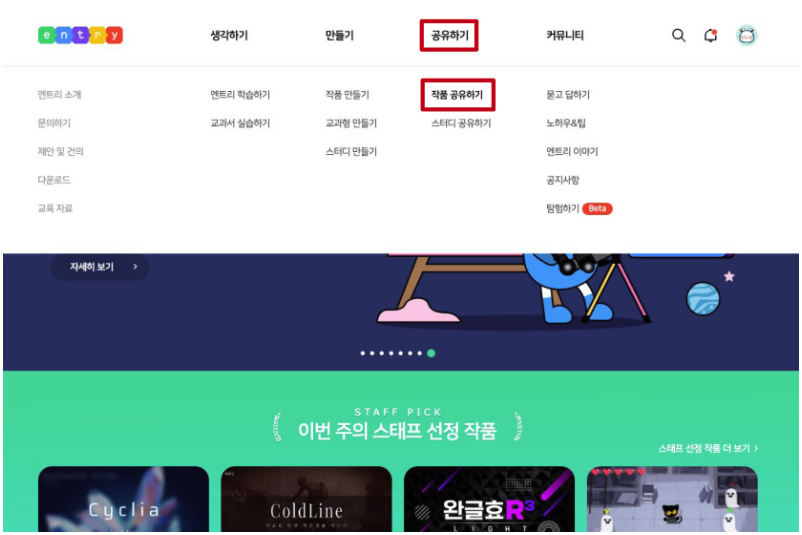    
			
🎱 둘러보기 추천하는 게임  
<a href="https://playentry.org/project/5b0295c7a9c557e3a9a21bfd"> https://playentry.org/project/5b0295c7a9c557e3a9a21bfd </a> - 쿠키런  
<a href="https://playentry.org/project/657e9ca34a39f10037355780"> https://playentry.org/project/657e9ca34a39f10037355780 </a> - 리듬게임  
<a href="https://playentry.org/project/5e103a971249000056aa2c85"> https://playentry.org/project/5e103a971249000056aa2c85 </a> - 표창 키우기   

<b> 엔트리 회원가입과 로그인 </b> 
- 엔트리는 로그인하지 않아도 사용할 수 있고, 만든 작품을 로컬 컴퓨터에 저장할 수 있습니다.
- 하지만 만든 여러가지 작품들을 엔트리 홈페이지 내에서 쉽고 편리하게 관리하기 위해서, 그리고 공유하기 위해서 네이버 이메일을 사용해 로그인합니다.
- 네이버 이메일이 없으면 엔트리 홈페이지 내에서 회원가입할 수 있습니다.    
			
			
🧐 엔트리에서 새 프로젝트를 열어보고 화면 구성을 익힙니다. <b> 만들기 → 작품 만들기 </b>    
 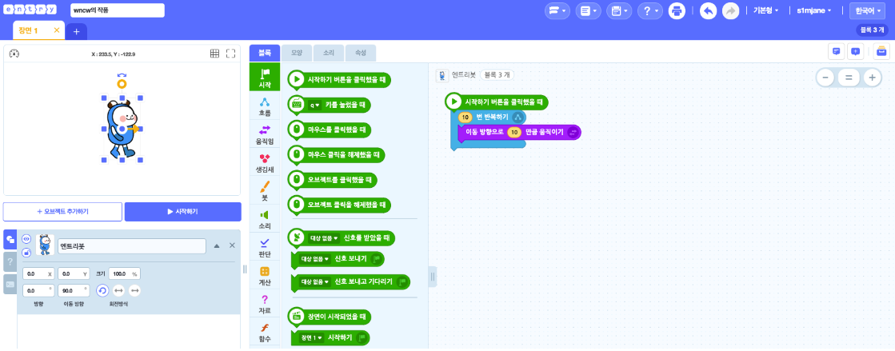    

<b> 작품 저장하기</b>
- 만든 작품의 이름을 정하고 작품을 저장하는 방법을 알려줍니다.
- 작품의 이름은 좌측 상단에서 변경할 수 있으며 저장된 작품들은 <b> 마이페이지 </b>에서 확인할 수 있습니다. 
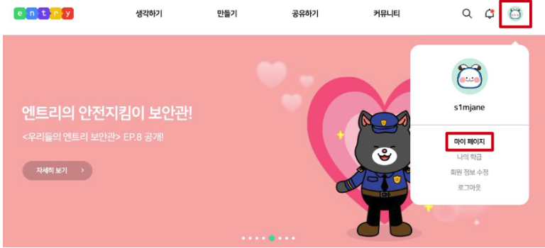   

### 오브젝트 알아보기
<b> 오브젝트란? </b>
- 오브젝트는 <b> 캐릭터, 사물, 배경, 글상자 등 작품에 들어가는 모든 것</b>을 말합니다.
- 엔트리에서 처음 프로젝트를 생성할 때 보여지는 기본 오브젝트는 엔트리봇입니다. 원하는대로 오브젝트를 추가/수정/삭제할 수 있습니다.    
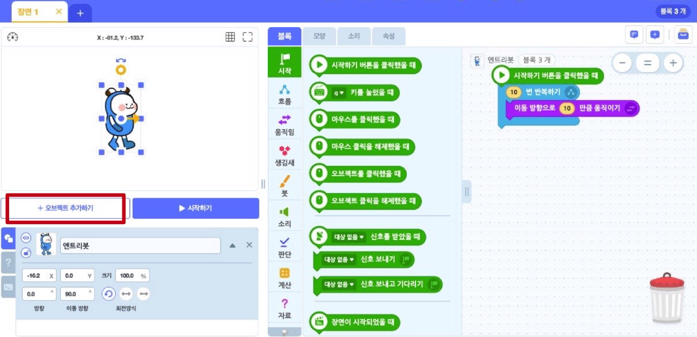  
기본적으로 엔트리에서 제공하는 오브젝트를 사용할 수 있습니다. 이 외에도 파일 올리기, 새로 그리기를 통해 엔트리가 제공하지 않는 나만의 오브젝트를 사용할 수 있습니다.   
- <b> 오브젝트 선택 </b>: 엔트리에서 기본으로 제공하는 오브젝트로, 엔트리봇/사람/동물/식물/탈것 등 많은 종류가 있습니다.  
- <b> 파일 올리기 </b>: 자신이 원하는 오브젝트를 찾을 수 없는 경우, 엔트리 외부에서 사진파일을 가져와 추가할 수 있습니다.  
- <b> 새로 그리기 </b>: 기존 오브젝트에서도, 사진 파일 검색에서도 자신이 원하는 오브젝트를 찾을 수 없는 경우, 직접 그림을 그려서 추가할 수 있습니다.  
- <b> 글상자 </b>: 작품 내 글자가 필요할 때, 글상자를 사용합니다. (글상자도 오브젝트라는 것을 다시 한 번 말해줍니다.)   
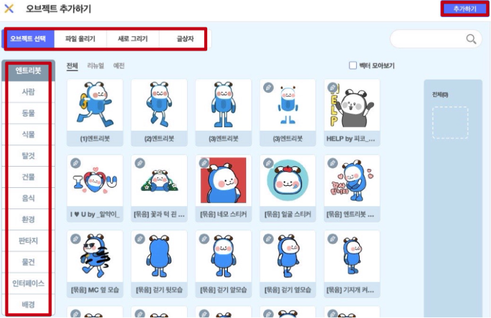    
<b> 오브젝트 선택, 파일 올리기, 새로 그리기, 글상자</b>에 대해 더 자세히 알아봅시다.   
			
<b> 오브젝트 선택 </b>
- 오브젝트 선택 메뉴에서 배경, 캐릭터, 음식 등 원하는 오브젝트를 선택합니다. 한 번에 여러 오브젝트를 선택할 수 있으며, 잘못 추가했더라도 삭제할 수 있습니다.    
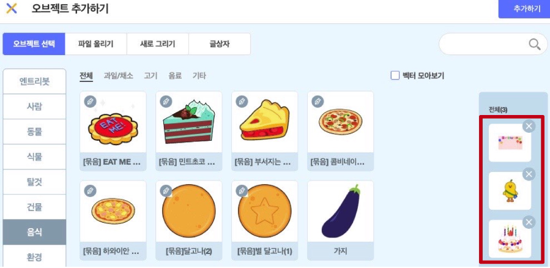    
마우스로 오브젝트를 원하는 위치로 이동시킬 수 있고(좌표 이동), 크기도 변경시킬 수 있다는 것을 보여줍니다. 사용하지 않는 오브젝트는 삭제합니다.    
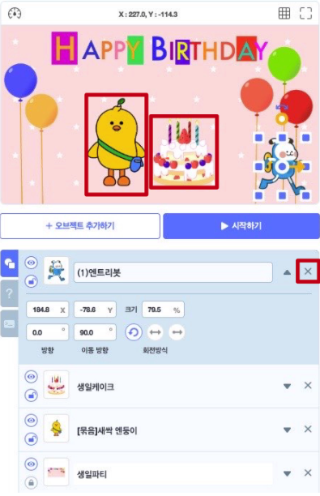    
🧱 원하는 오브젝트를 선택해 작품을 꾸며봅시다.   

<b> 파일 올리기 </b>
- 오브젝트 선택 메뉴에서 내가 넣고 싶은 오브젝트를 찾을 수 없을 때 원하는 사진을 가져와서 오브젝트로으로 만들 수 있습니다.
- 원하는 사진을 검색 후 다운로드 합니다. <b>파일 올리기</b>에서 저장한 파일을 가져옵니다.   
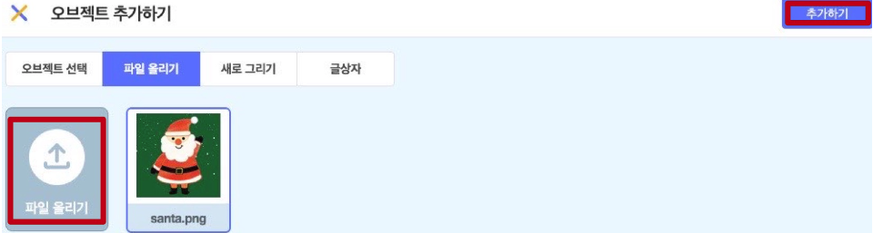    
사진의 배경을 지워서 오브젝트로 사용하고 싶을 때에는 <a href="https://www.remove.bg/ko"> https://www.remove.bg/ko </a>를 사용하면 편리합니다.  
파일 올리기를 통해 추가한 오브젝트도 엔트리에서 제공하는 기본 오브젝트와 마찬가지로 <b>위치 이동과 크기 조절이 가능함</b>을 보여줍니다.    
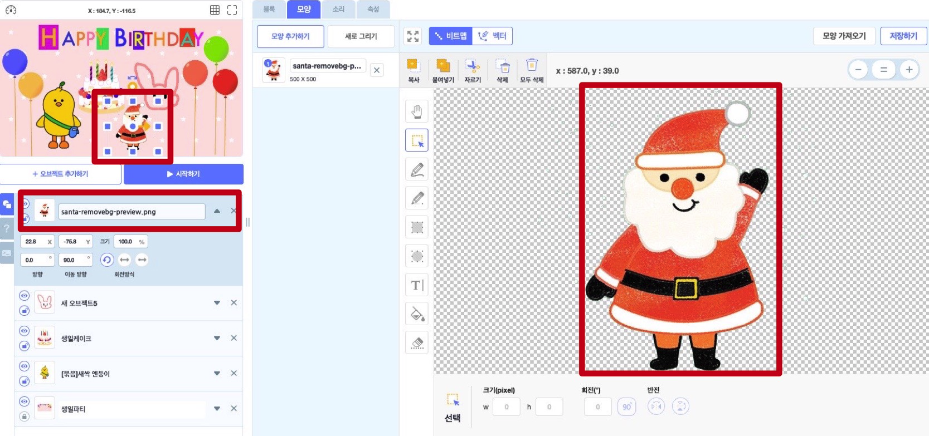    
🧱 원하는 배경과 사물을 찾아서 업로드 해봅시다.   

<b> 새로 그리기 </b>
- 새로 그리기에서는 배경, 캐릭터, 사물 등 내가 원하는 오브젝트를을 그릴 수 있습니다. 나만의 오브젝트를 만들어보는 시간을 가집니다.   
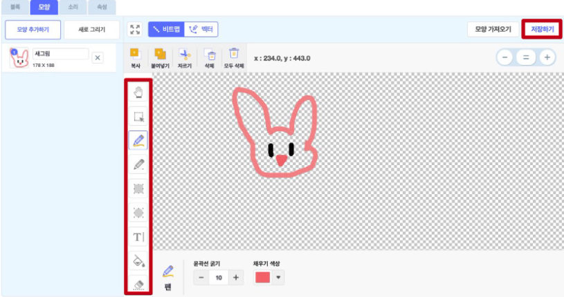    
나만의 오브젝트를 그려 만들어보고 저장한 후, 작품에 추가하여 확인해봅니다.   
새로 그리기를 통해 추가한 오브젝트도 엔트리에서 제공하는 기본 오브젝트와 마찬가지로 <b>위치 이동과 크기 조절이 가능함</b>을 보여줍니다.    
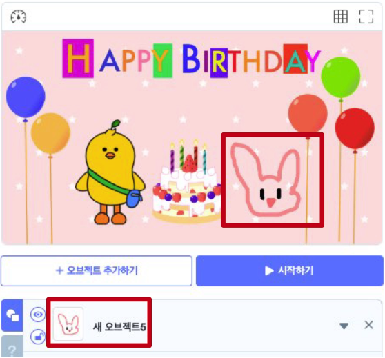    
🧱 원하는 그림을 그려서 작품에 추가해봅시다.   

<b> 글상자 </b>  
- 작품에 추가하고 싶은 글이 있을 때, 글상자를 사용합니다. 글씨체, 굵기, 밑줄, 색깔 등을 다양하게 설정할 수 있습니다.    
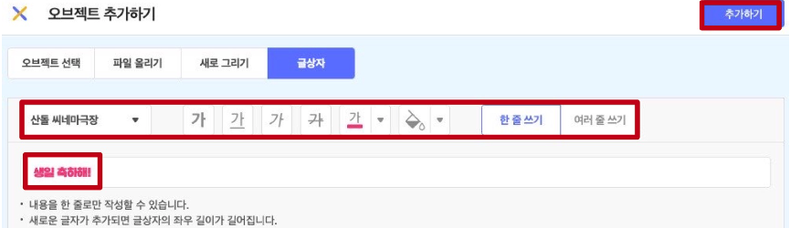    
🧱 추가하고 싶은 글을 적어 취향대로 커스텀한 후 작품에 추가해봅시다.    

### 오브젝트 움직이기 <좌표❓>
<b> 오브젝트 애니메이션화 하기 </b>  
- 애니메이션이란 <b>정지된 이미지의 전환</b>으로, 사람의 눈에 움직이는 듯한 착각이 들도록 하는 영상입니다. </b>    
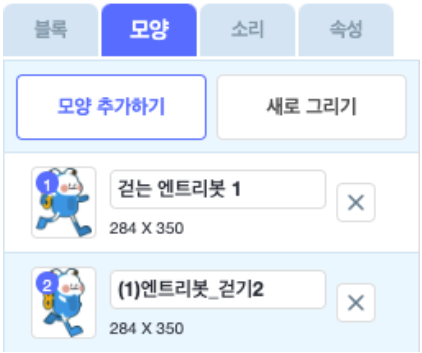    
- 엔트리봇의 그림이 다른 모습으로 2개 있습니다. 그림 모양을 번갈아가며 하나씩 클릭해보면 마치 연속하는 동작처럼 보이는데, 이것이 애니메이션의 기본적인 원리입니다.  
- 즉, 정지된 그림 여러장을 빠른 속도로 바꿔주면 마치 움직이는 동작처럼 보입니다.    
<h3> 🤹🏻 뛰는 엔트리봇 만들어보기 </h3>  

- '블록 → 생김새 → <b>다음 모양으로 바꾸기</b>' 블록을 사용하면 엔트리봇 오브젝트가 다음 모양으로 바뀌게 됩니다.    
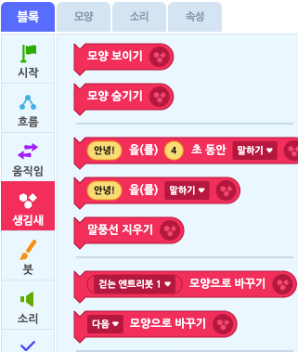   
- 모양이 한 번만 바뀌게 할 것이 아니라, 자동으로 계속 모양이 바뀌어 뛰는 것처럼 보이는 움직임을 만들고 싶기 때문에 '블록 → 흐름 → <b>계속 반복하기</b>' 블록을 사용합니다.    
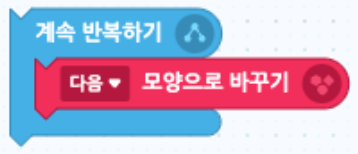    
- 자동으로 모양이 변하는 블록을 만들었지만 <b>시작하기 </b> 버튼을 눌러도 아직 시작 조건이 없기 때문에 아무 일도 일어나지 않습니다.    
- '블록 → 시작 → <b>시작하기 버튼을 클릭했을 때</b>' 블록을 사용하여 시작 조건을 추가해주고 작품을 시작해봅니다.    
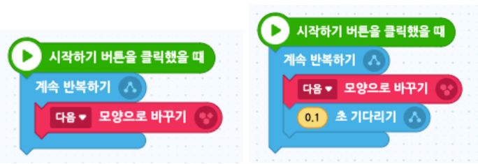    
- 엔트리봇이 뛰는 것처럼 보이지만 너무 빨라 자연스럽지 않습니다. 이런 경우에는 '블록 → 흐름 → <b>2초 기다리기</b>' 블록을 사용할 수 있습니다. 2초를 0.1초로 바꿔봅니다.  
- 다시 작품을 실행해보면 엔트리봇의 한결 자연스러운 움직임을 확인할 수 있습니다.     
<b> 🧐 다른 시작 조건 사용해보기 </b>  
- 엔트리는 각각의 오브젝트에 각기 다른 블록을 설정합니다. 각 오브젝트의 시작 조건, 활용 조건 등을 다르게 설정할 수 있습니다.  
- 이 엔트리봇의 시작 조건을 '시작하기 버튼을 클릭했을 때'가 아닌 '<b>마우스를 클릭했을 때</b>'로 바꿔보고 작품을 시작하여 엔트리봇을 클릭해보며 블록의 결과를 확인해봅시다.    
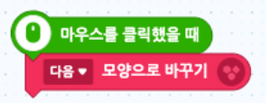   

<b> 좌표란? </b>  
- 좌표란 '<b>위치</b>'라고 할 수 있습니다. 어떤 오브젝트를 움직이고 싶다면 그것을 어느 위치로 이동시키고 싶은가를 알아야 합니다. 배경 위의 위치는 좌표로 알 수 있습니다.    
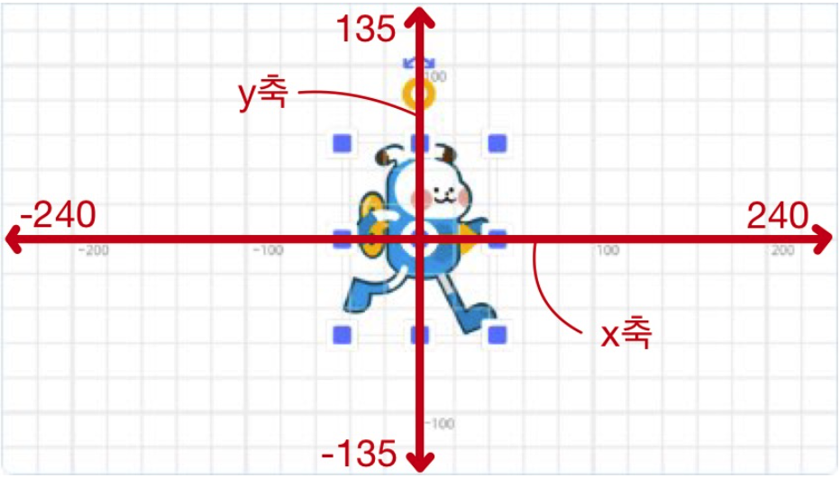    
- 좌표는 수평(가로) 위치와 수직(세로) 위치를 (x,y) 형태로 나타내는데, 정중앙에 위치한 점의 좌표가 (0,0)입니다.  
- 중앙 점을 기준으로 좌, 우 방향이 각각 x 축의 -와 + 방향이고, 상, 하 방향이 각각 y 축의 +와 - 방향입니다.    
- 좌표의 범위는 다음과 같습니다.  
﹒ x값: -240 ~ 240  
﹒ y값: -135 ~ 135    

<b>🤷🏻 상대좌표와 절대좌표</b> 
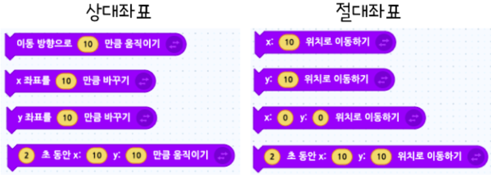    
<b>움직임</b> 분류에 속한 블록 중에 오브젝트 좌표 이동과 관련한 블록들이 있습니다. 위와 같은 블록들이 대표적입니다.    
﹒ 상대좌표에 있는 블럭들은 오브젝트가 공란에 입력된 x좌표 또는 y좌표 <b>만큼</b> 이동합니다.  
﹒ 절대좌표에 있는 블럭들은 오브젝트가 공란에 입력된 x좌표 또는 y좌표 <b>으로</b> 이동합니다.     

<h3> 🤹🏻 무한 반복 사용해서 움직이기 </h3>  

- '블록 → 움직임 → <b>x좌표를 10만큼 바꾸기</b>' 블록을 사용해서 엔트리봇을 오른쪽으로 10만큼 움직여봅니다.   
- 이번에는 '블록 → 흐름 → <b>계속 움직이기</b>' 블록을 사용해서 엔트리봇이 화면 오른쪽으로 계속 움직이도록 만들어봅니다.  
- 계속 움직이기 블록은 반복적인 작업을 대신 무한반복 해주기 때문에 엔트리봇이 움직이는 것같은 효과를 줄 수 있습니다. 숫자를 더 크게 해서 더 빠르게 움직이는 엔트리봇도 만들어봅니다.    
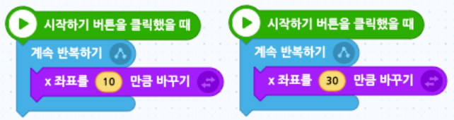   
- 이번에는 엔트리봇이 나의 마우스 포인터를 따라오게 만들어봅시다.    
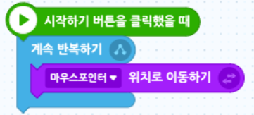   

<h3> 🤹🏻 계속 움직이는 엔트리봇 만들기 </h3>  

배경은 공간이 제한되어 있기 때문에 엔트리봇이 계속 한 방향으로 가다보면 벽을 통과해 사라지게 됩니다. 양쪽 벽을 왕복하며 뛰는 엔트리봇을 만들어봅시다.    
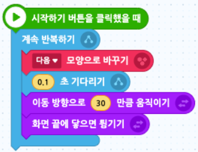    
엔트리봇이 벽을 왕복하며 뛰지만 벽에 튕겼을 때 엔트리봇의 상하좌우가 모두 바뀌는 것을 확인할 수 있습니다. 이를 해결하기 위해 다음 조건문을 넣어봅시다.  
'블록 → 흐름 → <b>만약 ~라면</b>', '블록 → 판단 → <b>~에 닿았는가?</b>'    
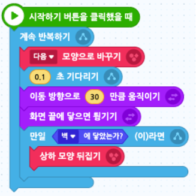   
🧱 작품을 시작하여 완성된 결과를 확인해봅시다.   

### 엔트리봇 음식 먹이기
<b> 엔트리봇 음식 먹이기 </b>  
- 이번 시간에는 <b>엔트리봇에게 음식을 주는 프로젝트</b>를 만들어 봅시다.     

<h3> 🤹🏻 프로젝트 개요 </h3>
 
<b>🧩 ver1. 숨기기, 보이기, 말하기를 배웁니다. </b>  
엔트리봇이 '안녕!' 2초간 인사한다.    
<b>🧩 ver2. 조건문에 대해 알아봅니다. </b>  
엔트리봇이 음식에 닿았을 때와 닿지 않았을 때 다른 글상자가 나타난다.    		
<b>🧩 ver3. 변수를 사용해봅니다. </b>  
엔트리봇이 먹은 음식 수를 카운팅할 수 있다.    

<b> 숨기기, 보이기, 말하기 </b>
- <b> step1. </b> 배경, 엔트리봇 오브젝트를 추가하고 크기 및 위치를 조정합니다.    
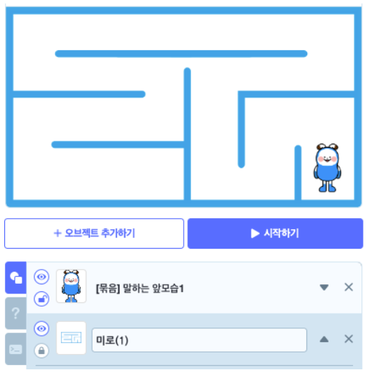  
- <b> step2. </b> 프로젝트를 시작했을 때는 엔트리봇이 보이지 않게 하기 위해 숨기기 블록을 사용합니다.    
블록 → 생김새 → <b>모양 숨기기</b>    
- <b> step3. </b> 아무곳이나 마우스를 클릭했을 때 엔트리봇이 나타납니다.    
블록 → 생김새 → <b>모양 보이기</b>    
- <b> step4. </b> 엔트리봇을 클릭하면 '안녕!'이라고 2초간 인사합니다.    
블록 → 생김새 → <b>~을 ~초 동안 말하기</b>    

<h3>🎱 결과</h3>

- 프로젝트를 시작하면 배경만 있는 상태에서, 아무 곳이나 마우스를 클릭하면 엔트리봇이 나타납니다. 엔트리봇을 클릭하면 '안녕!'이라고 2초간 말합니다.  
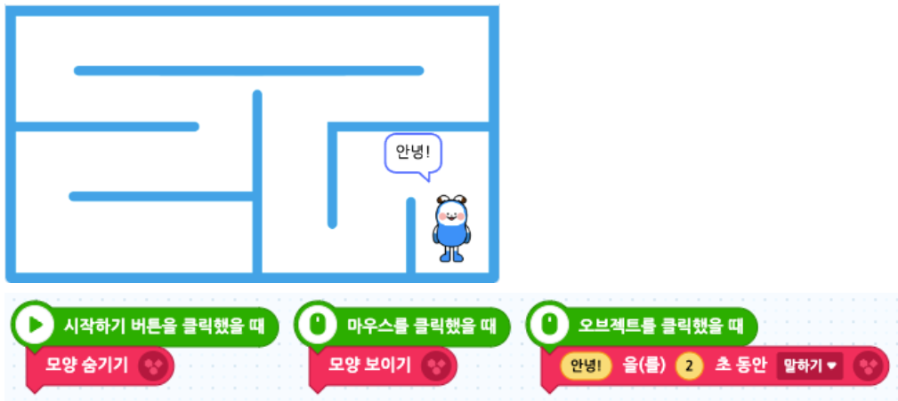  

<b> 조건문 알아보기 </b> 
- <b> step0. </b> 이전에 배운 블록들을 활용해서 키보드 방향키를 누르면 엔트리봇이 상하좌우로 움직이도록 만들어봅시다.    
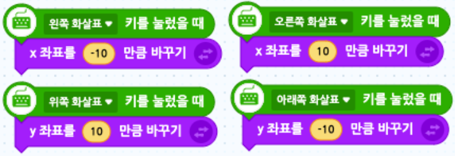    
- <b> step1. </b> 음식 오브젝트를 추가하여 위치와 크기를 조정하고 말풍선을 만듭니다.    
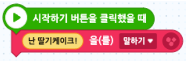   
- <b> step2. </b> 엔트리봇과 만났을 때는 음식이 사라져야하므로 조건 반복문을 사용합니다.   
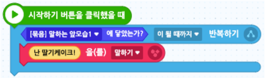   
- <b> step3. </b> 음식이 엔트리봇에 닿으면 사라지게 만듭니다.    
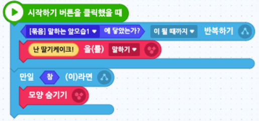   
- <b> step4. </b> 엔트리봇의 블록을 먼저 정리해줍니다.    
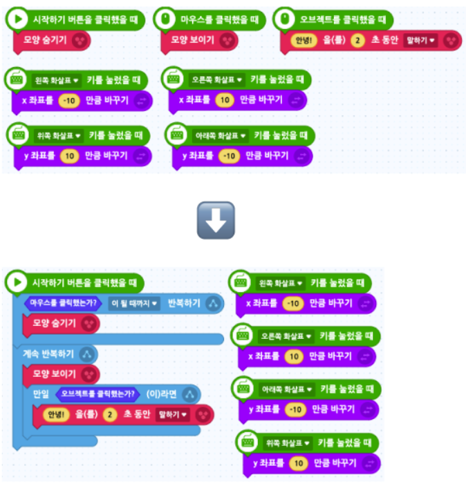   
- <b> step5. </b> 엔트리봇이 음식에 닿았을 때 '맛있다!'라고 2초간 말합니다.    
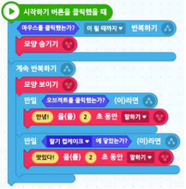   
엔트리봇과 음식이 닿았을 때 음식이 사라지는 시점이 동일하기 때문에 엔트리봇이 '음식과 닿았음'을 인식하지 못하는 문제점이 있습니다.   
- <b> step6. </b> 마지막 문제를 해결하기 위해 음식이 엔트리봇과 닿았을 때 0.01초 기다렸다가 사라지도록 블록을 수정합니다.    
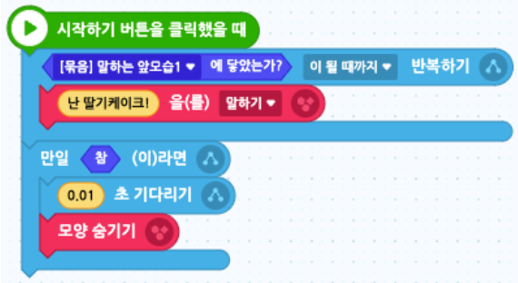   
<h3>🎱 결과</h3>

- 프로젝트를 시작하면 음식이 말을 하고있고, 아무 곳이나 마우스를 클릭하면 엔트리봇이 나타납니다. 엔트리봇을 클릭하면 '안녕!'이라고 2초간 말합니다. 
- 엔트리봇이 음식에 닿게 되면 음식은 사라지고 엔트리봇이 '맛있다!'라고 2초간 말합니다.  
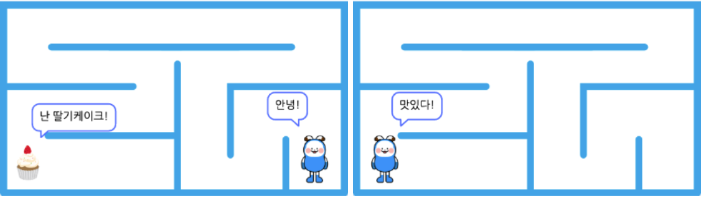  
			
<b> 변수 사용하기 </b>  
- 변수란 '<b>변하는 수</b>'라는 뜻입니다. 변수에는 숫자, 글자 등이 들어갑니다.    
- <b> step1. </b> 엔트리봇이 움직이며 먹은 음식의 갯수를 세기 위해 변수를 생성합니다.    
속성 → 변수 → <b>변수 추가하기</b>  
프로젝트 화면에 변수가 보입니다. 변수 기본값을 0으로 설정해놓았기 때문에 0으로 표시됨을 알려줍니다.    
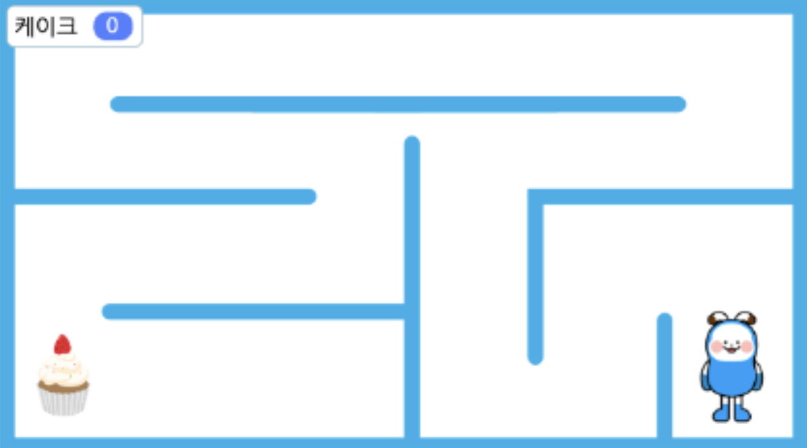    
- <b> step2. </b> 음식 오브젝트를 추가해 음식 갯수를 늘려줍니다. 처음 만든 컵케이크의 코드와 유사하기 때문에, 코드를 복사하고 붙여넣는 방법을 알려줍니다.    
새로 추가한 음식 오브젝트들의 코드 블럭을 다음과 같이 만들어주고, 기존의 음식 코드 블럭에는 변수에 1을 더하는 블록만 추가해줍니다.   
블록 → 자료 → <b>~에 ~만큼 더하기</b>    
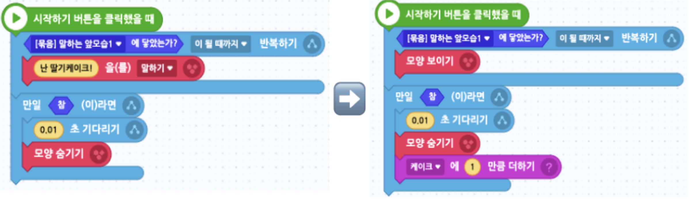   

<h3>🎱 결과</h3>

- 프로젝트를 시작하면 음식이 말을 하고있고, 아무 곳이나 마우스를 클릭하면 엔트리봇이 나타납니다. 엔트리봇을 클릭하면 '안녕!'이라고 2초간 말합니다. 
- 엔트리봇이 음식에 닿게 되면 음식은 사라지고 변수는 1씩 증가합니다. 마지막 음식을 먹었을 때 엔트리봇이 '맛있다!'라고 2초간 말합니다. 
- 음식을 먹은 갯수만큼 변수의 점수가 올라갑니다.    
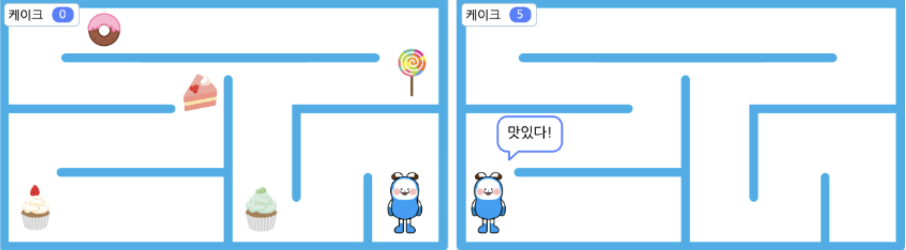   

