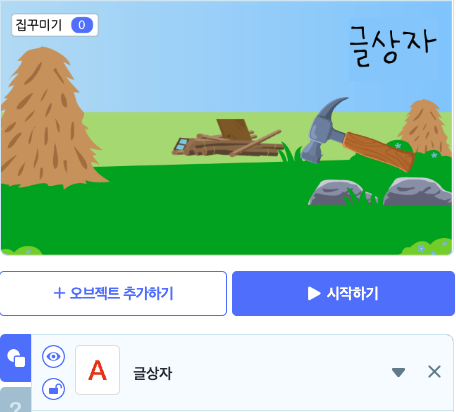
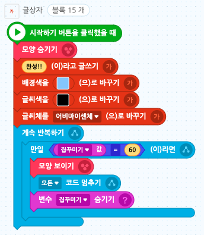

# 03. 집 키우기
<h3>3강 집 키우기</h3>

🙂 이번 시간에는 클릭하여 플레이하는 게임을 만들어봅니다.  
🚩 변수를 설정하고 클릭 수에 따라 오브젝트가 변화하도록 게임을 코딩하는 과정에서 변수의 특성과 개념을 학습할 수 있습니다.  
⇢ 오늘 만드는 애니메이션 완성본 <a href="https://playentry.org/project/65914c1249a4b3001a363fb2"> https://playentry.org/project/65914c1249a4b3001a363fb2   

<b>🧩 step1. </b>
- 배경, 통나무, 망치 오브젝트를 추가합니다. 
- 이때 망치 오브젝트 내에서 (모양에서) 퀄리티가 좋아지는 단계별로 집 5개를 추가합니다. 통나무~완성 총 6단계 집이 한 목록 내에 있습니다.  
- 집 오브젝트들을 하나하나 보며 크기를 조정합니다. 퀄리티가 좋아질수록 크기가 커지도록 조정합니다.  
- 망치 오브젝트를 추가한 후, 그 안에 똑같은 망치오브젝트를 하나 더 추가합니다. 
- 추가한 망치 오브젝트를 30도 정도 회전시킨 후 수정저장합니다. (망치로 두드릴 때 사용하는 느낌이 나도록하기 위해서)  

  

<b>🧩 step2. </b>
- 망치가 마우스포인터를 따라오도록 합니다. 이때, 망치의 중심점을 바꿉니다. 
- 중심점 위치를 바꾸지 않으면 집 오브젝트가 클릭되지 않고 망치오브젝트가 클릭되기 때문에 망치 오브젝트 밖으로 중심점의 위치를 변경합니다. 

  

<b>🧩 step3. </b>
- 마우스를 클릭했을 때 망치가 움직이는 느낌을 주기 위해서 <b>모양 바꾸기 블록</b>을 사용합니다.  
- 망치를 사용하지 않을 땐 '아니면' 블록에 속한 모양이고, 마우스를 클릭하는 순간에만 '만일 마우스를 클릭했는가?라면' 블록에 속한 모양이라는 것을 설명합니다. 

  

<b>🧩 step4. </b>
- 집 레벨을 업그레이드하기 위해 필요한 변수를 추가합니다. 

  

<b>🧩 step5. </b>
- 집 오브젝트를 클릭하면 변수에 1이 추가되게 만듭니다.   <b>자료 → 변수에 1만큼 더하기</b> 

  

<b>🧩 step6. </b>
- 변수가 일정 수에 도달하면 집의 퀄리티가 좋아지도록하는 <b>조건문</b>을 만듭니다.  
- 집을 클릭할 때마다 변수가 +1 되는 것을 확인해보고, 망치가 마우스를 따라 움직이며 클릭할 때마다 모양이 변하는지 확인합니다.  
- 또한 조건문으로 설정한 일정 수가 되면 집의 퀄리티가 레벨업되는지 확인해봅니다.  
- 레벨이 업그레이드될 때마다 소리가 추가되도록 만들고 프로그램을 실행시켜봅니다. 

  

<b>🧩 step7. </b>
- 글상자 오브젝트를 추가하여 '완성'을 표시합니다.
- 글상자는 시작하기 버튼을 클릭했을 때는 숨겼다가, 집꾸미기 변수값이 60이 되면 '완성'을 표시하도록 합니다.
- 집꾸미기 변수값이 60이 되면 변수 표시가 안 보이디록 '변수 숨기기' 블록을 사용합니다.
- 집꾸미기가 완성이 되면 모든 코드를 멈춰줍니다. '모든 코드 멈추기'블록을 사용합니다.  

