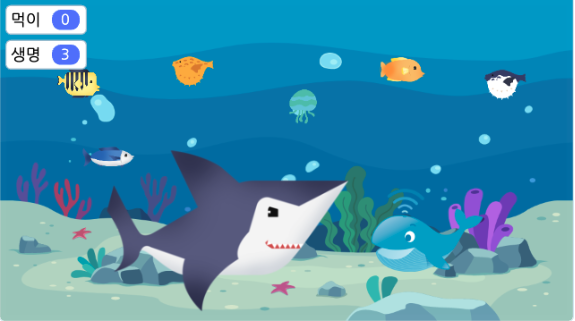
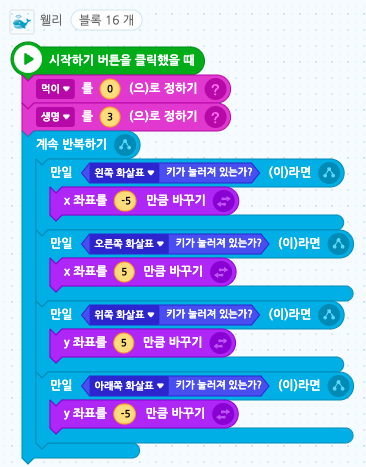
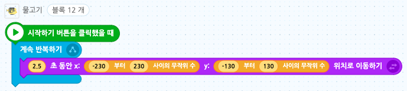
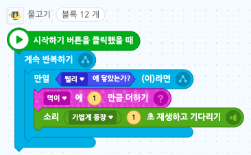
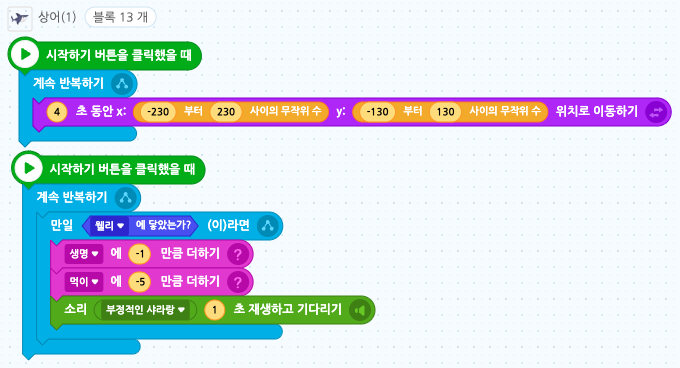
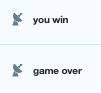
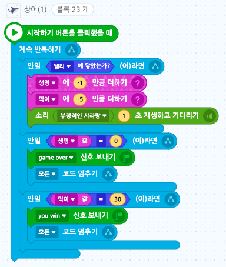
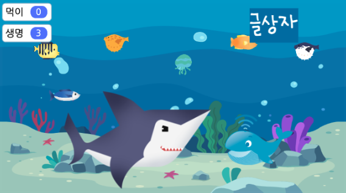
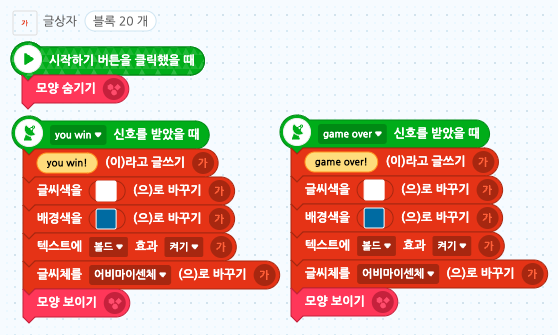

# 04. 상어를 피해라
<h3>4강 상어를 피해라</h3>

🙂 이번 시간에는 방향키를 이용하여 움직이고 상어를 피해 먹이를 먹는 게임을 만들어봅니다.  
🚩 변수를 설정하고 먹이 오브젝트에 닿으면 먹이 변수가 +1 되는 것, 상어 오브젝트에 닿으면 변수가 -1 되는 것 등의 기능을 만들어봅니다.  
⇢ 오늘 만드는 애니메이션 완성본 <a href="https://playentry.org/project/65a8e410d4ef07002c963dd6"> https://playentry.org/project/65a8e410d4ef07002c963dd6   

<b>🧩 step1. </b>
- 필요한 오브젝트를 추가합니다. (배경, 물고기들(먹이), 고래(나), 상어(적)) 
- 상어 크기를 키우고, 먹이들의 크기는 줄여줍니다.
- 먹이, 생명 변수를 추가하고, 고래의 이동을 위한 코드를 만들어줍니다. 
- 먹이 변수는 0으로, 생명 변수는 3으로 초기화합니다.

  

<b>🧩 step2. </b>
- 고래를 제외한 다른 모든 물고기들의 무작위 움직임을 추가해줍니다. (이동)
- 물고기들의 이동 속도를 각각 다르게 해주면 좋습니다.
- 이때, 상어의 속도는 보다 더 느리게 해줍니다.  
  
- 물고기들이 고래에 닿으면 먹이 변수에 1을 더하게 해줍니다. (변수 조건)
- 이때 '소리 재생하고 기다리기' 블록을 사용해 변수가 한 번에 많이 변하지 않도록 제어해줍니다.  
  
- 이 두 블록을 모든 물고기들에 복사&붙여넣기 합니다.
- 이동 속도, 소리가 각각 다르면 예측이 어려워 더욱 재미있습니다.   

<b>🧩 step3. </b>
- 상어도 무작위로 천천히 움직이게 해줍니다. (이동)
- 다른 코드 블럭으로는, 웰리에 닿으면 생명 변수는 -1, 먹이 변수는 -5 되게 해줍니다. (변수 조건)
- 이 때도 '소리 재생하고 기다리기' 블록을 통해 변수가 한 번에 많이 바뀌는 것을 방지합니다. 
  

<b>🧩 step4. </b>
- game over, you win 신호를 추가합니다.
- 생명 변수가 0이 되면 game over 신호를 보내고 게임을 멈춥니다.
- 먹이 변수가 30이 되면 you win 신호를 보내고 게임을 멈춥니다.
- 게임을 멈출 때는 '모든 코드 멈추기' 블록을 사용합니다.   
 
  

<b>🧩 step5. </b>
- 글상자를 추가합니다.
- 처음엔 보이지 않도록 숨겨줍니다.
- you win 신호를 받으면 'You Win!' 이라고 글을 써서 보여줍니다.
- game over 신호를 받으면 'Gmae Over!' 이라고 글을 써서 보여줍니다.  
 
  
