# 05. 아기새를 지켜라
<h3>5강 아기새를 지켜라</h3>

🙂 이번 시간에는 오브젝트를 무작위 위치로 보내고, 변수와 타이머를 활용하여봅니다.  
🙂 아기새를 따라다니는 박쥐를 클릭하여 공격할 수 없게 만들어주고, 생명을 다 잃지 않고 30초를 버티면 승리합니다.  
🚩 오브젝트를 이동시키고, 숨기거나 보일 수 있으며 조건문, 변수, 타이머, 신호, 소리 등을 사용할 수 있습니다.   
⇢ 오늘 만드는 애니메이션 완성본 <a href="https://playentry.org/project/65a9d3bf77b578001a9bb03e"> https://playentry.org/project/65a9d3bf77b578001a9bb03e   

<b>🧩 step1. </b>
- 필요한 오브젝트를 추가합니다. 배경, 새, 박쥐
- 아기새의 생명을 나타내는 변수와 30초를 버텨내면 win을 표시하도록 돕는 신호를 추가합니다.
- 시작하기 버튼을 눌렀을 때 초시계를 시작하고, 30초 후 win 신호와 함께 초시계 정지, 모든 코드를 멈춰 게임을 끝냅니다. 
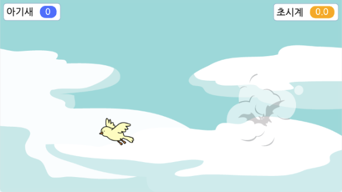 
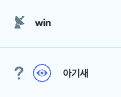
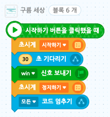   

<b>🧩 step2. </b>
- 첫 번째로, 아기새의 날갯짓을 표현하기 위한 반복문을 추가합니다. (동작/모양)
- 계속해서 다음 모양으로 바뀌도록 만듭니다.
- 두 번째로, 아기새의 이동을 위한 반복문을 추가합니다. (이동)
- 시작 위치를 정한 후, 계속해서 무작위 위치로 이동할 수 있도록 합니다.  
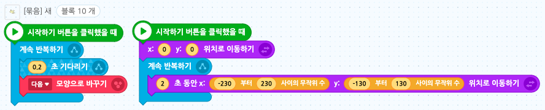   

<b>🧩 step3. </b>
- 박쥐가 아기새를 따라갈 수 있도록 합니다.
- 처음 위치를 정한 후, 아기새를 2초 느리게 따라가도록 '2초 동안 새 위치로 이동하기' 코드를 사용합니다.
- 2초보다 작은 수를 사용하면 박쥐가 아기새를 빨리 따라가기 때문에 게임 난이도가 올라갑니다.
- 보다 자연스러운 모양을 위해 '좌우 모양 뒤집기' 블록을 사용합니다. 
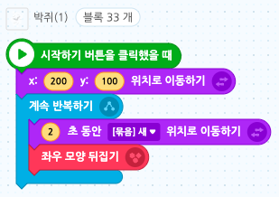   
- 박쥐의 처음 모양과 클릭했을 때의 모양을 정합니다.
- 시작하기 버튼을 눌렀을 때의 모양을 설정한 후, 박쥐 오브젝트를 클릭하면 2초간 클릭했을 때의 모양으로 변할 수 있도록 반복문을 만듭니다.  
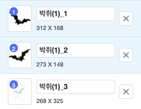
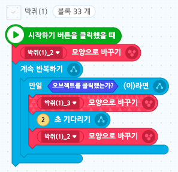   
- 박쥐가 아기새 변수를 -1 할 수 있는 조건문입니다.
- 처음 변수를 5로 정하고, 변수가 0이 되면 초시계를 숨기며 game over 신호를 보내고 모든 코드를 멈춰 게임을 끝냅니다. (game over 신호를 추가해줍니다.)
- -1 할 수 있는 조건은 다음과 같습니다. 박쥐의 모양이 처음(정상)모양이면서 ('그리고'!) 새에 닿은 경우, 아기새 값에 -1을 더해줍니다.
- 위와 같이 코딩하면 박쥐의 모양이 클릭했을 때의 모양인 상태에서 아기새에 닿아도 -1되지 않습니다.
- 소리를 재생하고 기다리는 시간 지연을 통해 변수가 많이 변하지 않도록 제한합니다.  
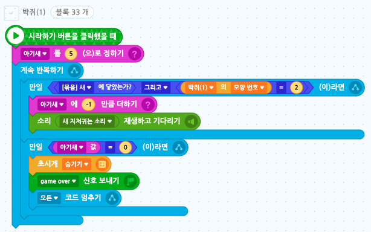   

<b>🧩 step4. </b>
- 변수값이 증가할 수 있도록 아이템을 추가합니다.
- 오브젝트를 추가한 후, 아이템이 게임 시작 후 5초 뒤에 나올 수 있도록 모양 숨기기, 기다리기, 보이기 블록을 사용합니다.
- 이때, 무작위 위치에서 나타날 수 있도록 합니다.  
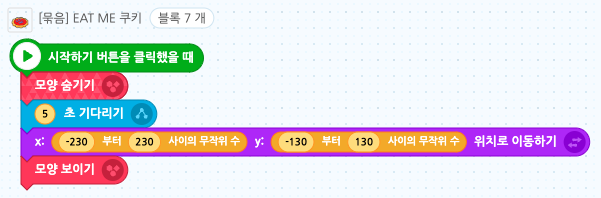   
- 아이템이 새에 닿으면 모양을 숨겨주고 변수에 +1 해줍니다.
- 사라지고 5초 뒤 다시 무작위 위치에 나타나도록 합니다. 
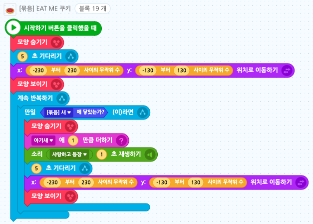   

<b>🧩 step5. </b>
- 글상자를 추가합니다.
- 시작 시 모양을 숨겨줍니다.
- win 신호를 받으면 '아기 새 지키기 성공!'이라고 글을 써주고, game over 신호를 받으면 'game over' 글을 써 보이게 합니다. 
  
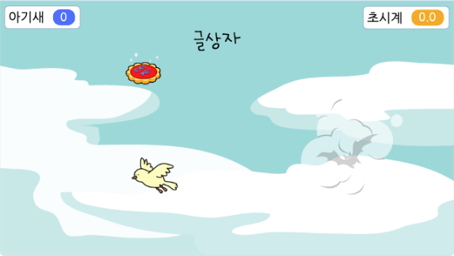   

