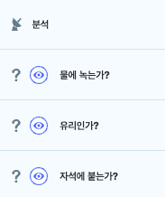

# 6. 자동 분리수거하기
<h3>6강 자동 분리수거하기</h3>

🙂 이번 시간에는 쓰레기들이 유리, 종이, 캔, 플라스틱으로 자동으로 분리수거가 되는 프로그램을 만들어봅니다.  
🚩 분리수거와 관련된 문제를 해결할 수 있는 조건문을 만들 수 있다. 필요한 변수를 추가할 수 있고, 화면구성, 동작, 처리과정 등을 절차에 따라 만들 수 있다.   
⇢ 오늘 만드는 애니메이션 완성본 
<a href="https://playentry.org/project/65a0e7556e48ba002c024726"> https://playentry.org/project/65a0e7556e48ba002c024726   
   

<b>🧩 step1. </b> 준비하기  
- 공장 느낌의 배경과 센서, 쓰레기, 분리수거통 오브젝트를 추가합니다. 
  
- 분리수거통을 3번 복제하여 4개로 만들고, 각 4개를 다른 모양으로 하여 배치합니다.  
    
- <b>쓰레기 오브젝트 내에</b> 다른 쓰레기들을 추가합니다. 유리, 캔, 플라스틱, 종이 종류로 하여 최소 4개의 오브젝트가 필요합니다.  
  
- '분석' 신호를 추가합니다.
- '유리인가?', '물에 녹는가?', '자석에 붙는가?'라는 조건에 필요한 변수를 추가합니다. 
   

👼🏻 이번 시간에는 코드가 어렵지는 않지만, 코드를 생각해내는 과정이 도움이 될 것 같아 학생들이 조건을 직접 생각하며 만들 수 있도록 생각하는 시간을 많이 주면 좋을 것 같습니다! (항상 그렇지만요,,! :P)

<b>🧩 step2. </b> 쓰레기 코딩하기  
- 시작하기 버튼을 클릭했을 때, 쓰레기 오브젝트가 8가지 중 랜덤하게 나올 수 있도록 무작위 모양으로 바꾸는 블록을 사용합니다.
- 컨베이어벨트를 따라 내려올 수 있도록 적절한 속도와 좌푯값을 조정해줍니다. 
  
- 센서에 닿았으면 신호를 보내고 응답이 올 때까지 기다려줍니다. 조건문을 사용합니다.  
  

<b>🧩 step3. </b> 분석하기  
- 분석 신호를 받았을 때 처리하기 위해 센서를 코딩해줍니다.
- 쓰레기의 모양번호를 기준으로 하여 유리/플라스틱/캔/종이를 구분해줍니다.
- 종이라면 '자석에 붙는가?' 변수에 'N', '물에 녹는가?' 변수에 'Y', '유리인가?' 변수에 'N'를 표시할 수 있도록 해줍니다.
- 나머지도 함께 정해봅니다. 
  

<b>🧩 step4. </b> 처리하기  
- 분석 신호에 대한 응답을 받았을 때, 받은 변수 값들을 조건문을 사용하여 처리합니다.
- 캔이라면 캔분리수거함 위치로 이동하도록, 다른 것들도 각각에 맞는 분리수거함으로 이동하도록 해줍니다. 
- 이때 분리수거함으로 이동하는 속도가 비슷하게 보이기 위해서 각각 속도를 다르게 해줍니다.
  

<b>🧩 step5. </b> 반복하기  
- 분리수거함으로 이동이 끝나면 모양을 숨겨주고, 
- 다시 랜덤모양으로 바꾼 후 숨긴 상태로 위치 이동 후, 
- 위치가 이동된 후에야 모양을 보이게 해주는 알고리즘을 생각해봅니다.
- 위의 코딩을 반복해줍니다.  
  