# 13. 그림판
<h3>13강 그림판</h3>

🙂 이번 시간에는 붓 블록을 활용하여 그림판을 만들어봅니다.  
🚩 그리기, 지우기, 투명도, 굵기, 색깔을 바꾸는 등 붓 블록들을 활용하여 그림판에 다양한 기능을 만들어낼 수 있습니다.  
⇢ 오늘 만드는 애니메이션 완성본 
<a href="https://playentry.org/project/659ba0823586b7002c08f8e0"> https://playentry.org/project/659ba0823586b7002c08f8e0   
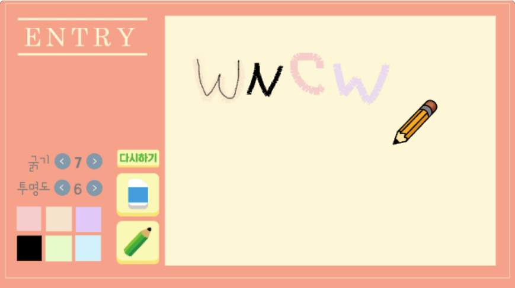  

<b>🧩 step1. </b> 필요한 오브젝트를 추가합니다. 
- 배경, 글상자(굵기), 글상자(투명도), 업다운 버튼 각 2개씩, 글상자(굵기 숫자 표시), 글상자(투명도 숫자 표시)
- 다시하기 버튼, 지우개 버튼, 연필 버튼
- 마우스 따라다니는 연필과 지우개
- <b>이때 마우스를 따라다니는 연필과 지우개는 오브젝트 목록 중 맨 위에 위치하여야 합니다.</b> (오브젝트 목록에서 드래그하여 위로 위치시킵니다.)
- 배경이 계속 클릭되어 불편하니, 자물쇠를 클릭하여 고정시켜줍니다. 
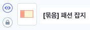 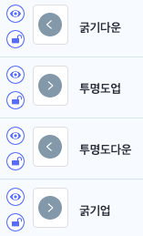 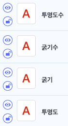 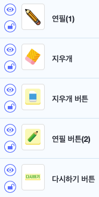  
  

<b>🧩 step2. </b>  
- 연필과 지우개가 마우스를 따라다닐 수 있게 합니다.
- 이때 시작하기 버튼을 클릭하면 일단 연필이 먼저 보이게 하기 위해, 시작하기 버튼을 눌렀을 때 지우개는 보이지 않게 해줍니다. 
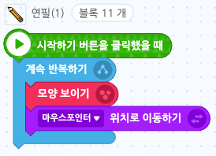 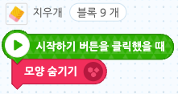   
- 연필/지우개 버튼을 누르면 신호가 갈 수 있도록 신호를 추가해줍니다.  
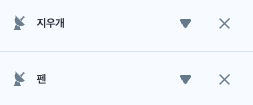  
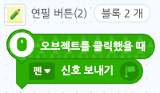 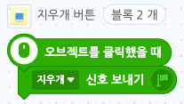  
- 지우개 오브젝트는 연필 신호를 받으면 보이지 않게 처리해주고, 지우개 신호를 받으면 보이게 처리한 후 마우스포인터를 따라가게 해줍니다.
- 반대로 연필 오브젝트는 연필 신호를 받으면 보이게 처리한 후 마우스포인터를 따라가게, 지우개 신호를 받으면 보이지 않게 처리해줍니다. 
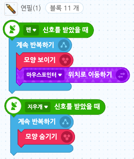 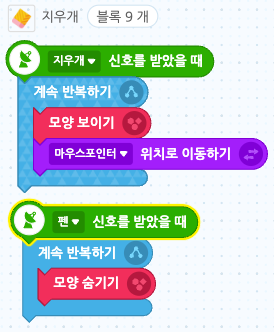  
- 이때, 마우스가 클릭하여 그림을 그려야하기 때문에, 연필/지우개 오브젝트가 방해되지 않도록 중심점을 오브젝트 밖으로 변경해줍니다.  
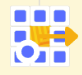 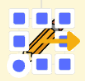  

<b>🧩 step3. </b> 굵기와 투명도를 설정합니다. 
- '굵기', '투명도' 글을 표시할 글상자 두 개는 '굵기', '투명도'로 설정해줍니다.
- '굵기 수', '투명도 수'를 표시할 글상자 두 개는 각각 버튼 사이에 배치합니다.
- 굵기, 투명도를 변수로 추가하고, 장면에 보이지 않도록 눈감기 상태로 만들어줍니다.
- 굵기는 기본값을 1로, 투명도는 기본값을 0으로 설정합니다.
- 굵기수를 표시할 글상자에 '굵기' 변수값이, 투명도수를 표시할 글상자에 '투명도' 변수값이 표시되도록 코딩합니다.   
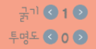 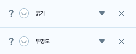 
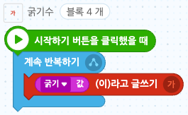 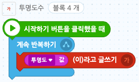  

<b>🧩 step4. </b> 굵기와 투명도가 바뀔 수 있게 버튼을 추가해줍니다. 
- '얇게', '굵게', '투명하게', '불투명하게' 신호를 추가해줍니다.
- 버튼을 통해 신호를 보내야, 실제 붓의 굵기와 투명도가 바뀔 수 있기 때문에 신호가 필요합니다.
- 굵기 변수와 투명도 변수가 표시되는데, 버튼을 누를 때마다 값이 바뀌기 때문에, 그 계산값을 업데이트해주기 위해 아래와 같이 코딩합니다.  
- 굵기업 버튼 오브젝트를 누르면 '굵게' 신호를 보내고, 굵기 변수에 +1 해줍니다.
- 굵기다운 버튼 오브젝트를 누르면 '얇게' 신호를 보냅니다.
- 이때, 굵기 변수값이 1보다 작거나같다면 변수가 변하지 않게 0을 더해주고, 굵기 변수 값이 1이 아닌 경우에만 -1 되게 해줍니다. 
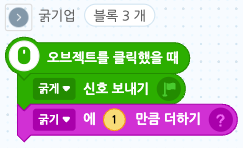 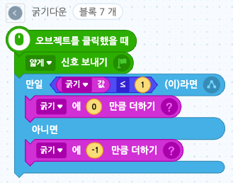   
- 투명도업 버튼 오브젝트를 누르면 '투명하게' 신호를 보냅니다.
- 투명도는 0~10까지만 허용하므로, 투명도 변수값이 10이상이면 더이상 바뀌지 않도록 0을 더해주고 10 미만인 경우에만 +1을 해줍니다.
- 투명도 다운 버튼 오브젝트를 누르면 '불투명하게' 신호를 보냅니다.
- 투명도 변수값이 0 이하라면 더이상 변하지 않도록 0을 더해주고, 0 초과인 경우에만 -1을 더해줍니다.  
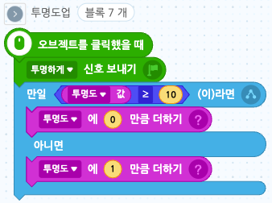 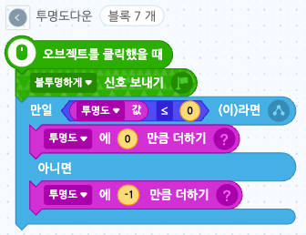   

<b>🧩 step5. </b> 색깔 오브젝트를 추가해줍니다. 
- 오브젝트 추가하기 > 새로 그리기 > 사각형 그리기
- 원하는 색깔을 지정하여 사각형을 그려줍니다. 같은 방법으로 색깔을 6가지 추가해줍니다.
- 오브젝트 목록에서 하나를 선택해 '복제하기'할 수 있습니다. 6가지 오브젝트의 크기가 같게 하면 화면에 정갈하게 배치할 수 있습니다.  
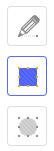 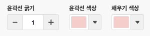 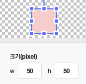 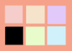   

<b>🧩 step6. </b> 색깔 신호를 추가합니다. 
- 색깔을 눌렀을 때 그리기 색깔이 그 색으로 나올 수 있도록 신호를 주기 위해 색깔 신호를 각각 추가합니다.
- 각 색깔 오브젝트를 눌렀을 때 신호를 주도록 다음과 같이 6가지 색깔 모두 추가해줍니다.  
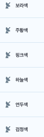 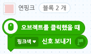 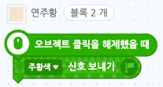   

<b>🧩 step7. </b> 포인터를 추가합니다. 
- 오브젝트 추가하기 > 새로 그리기 > 점
- 점을 찍어 오브젝트를 추가합니다. 이 점을 가지고 그림을 그립니다. 이 점이 마우스를 따라오도록 합니다.
- 연필은 그저 사용자가 그림을 그린다고 알 수 있게 보여주는 수단이며, 사실 그림을 그리는 것은 점입니다.  
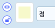 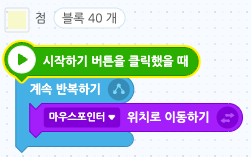  
- 마우스를 클릭한 경우에만 그릴 수 있도록 조건문을 사용합니다. 마우스를 뗀 경우, 즉 마우스를 클릭하지 않은 경우에는 그리기를 멈추도록 합니다. 
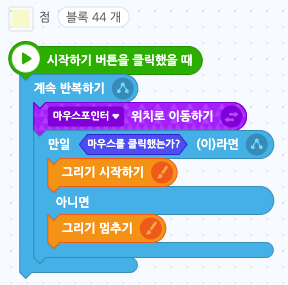  
-  프로젝트를 시작하면 디폴트값으로 그리기굵기는 1로, 색은 검정색으로 설정되게 해줍니다. 프로젝트를 시작할 때마다 다음과같이 초기화됩니다. 
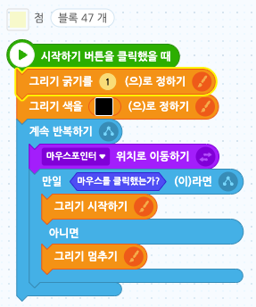  

<b>🧩 step8. </b> 전체삭제 버튼 기능을 추가합니다. 
- 전체삭제 버튼을 누르면 전체삭제 신호가 보내지고, 그 신호를 받은 그림이 모두 지워지도록 합니다.
- 전체삭제 신호를 추가합니다.  
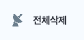 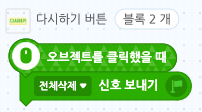 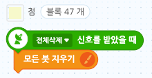  

<b>🧩 step9. </b> 색깔을 바꿔줍니다. 
- 각 색깔을 눌렀을 때 신호를 보내도록 아까 코딩을 했습니다.
- 점 오브젝트는 이 신호를 받았을 때 각각 그 색깔로 그리기 색이 바뀌도록 합니다.  
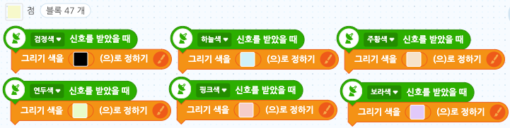  

<b>🧩 step10. </b> 굵기와 투명도를 설정합니다. 
- 앞서 굵기 조절 버튼, 투명도 조절 버튼을 각각 누르면 '굵게, 얇게, 투명하게, 불투명하게' 신호가 가도록 설정했습니다.
- 그 신호들을 '점' 오브젝트가 받아서 붓의 상태를 변경할 수 있습니다.
- 다음과같이 신호를 받을 때마다 +1, -1, +10%, -10% 바뀌도록 합니다. 
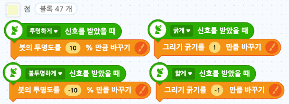   

<b>🧩 step11. </b> 지우개 기능을 만들어봅니다. 
- 지우개 버튼을 눌러 지우개 신호를 받았을 때, 붓을 배경화면과 같은 색으로 설정하고, 굵기는 20으로 해줍니다.
- 사실은 그리는 것이지만, 배경색과 같기 때문에 지우는 것으로 인식됩니다.  
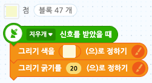  

<b>🧩 step12. </b>  
- 현재로서는 지우개를 썼다가 다시 펜을 선택했을 때, 펜이 여전히 굵기20, 색은 배경색으로 설정되어 있습니다.
- 그래서 펜을 선택할 때 다시 '펜' 신호를 주고, 신호를 받아와 다시 펜을 검정색으로 초기화하며, 그리기 굵기는 '굵기' 변수값으로 정하여줍니다.  
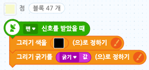   

