# 14. 펫키우기
<h3>14강 펫키우기</h3>

🙂 이번 시간에는 펫에게 필요한 것들을 주는 프로그램을 만들어봅니다.  
🚩 좌표 이동, 오브젝트간의 상호작용, 신호, 변수 등을 활용할 수 있습니다.  
⇢ 오늘 만드는 애니메이션 완성본 
<a href="https://playentry.org/project/659d0b127a14f5002592256e"> https://playentry.org/project/659d0b127a14f5002592256e   
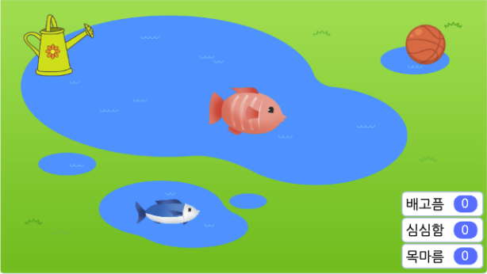   

<b>🧩 step1. </b> 펫 소개하기  
- 맘에 드는 배경과 키우고 싶은 펫을 선택해서 가져옵니다. 
- 시작하기 버튼을 누르면 펫의 시작위치를 지정해 주고 자기소개를 하도록 만들어 줍니다.  
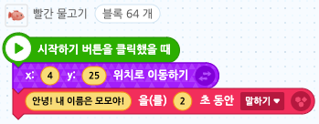  

<b>🧩 step2. </b> 펫 움직이기  
- 펫의 모양이 하나라면, 모양을 복제하고 적절하게 바꾼 모양 한두개를 추가해줍니다. (회전하기/색깔바꾸기/크기바꾸기 등 사용)  
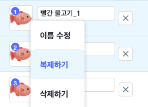 
- 시작시 처음 모양을 지정해주고, 움직일 때 보이기 원하는 모양이 나오도록 반복문과 모양 바꾸기 블록을 적절하게 만들어줍니다. 
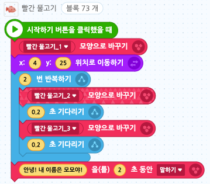  

<b>🧩 step3. </b> 펫 음식먹이기  
- 펫에게 먹일 음식 오브젝트를 추가해줍니다.
- '음식'이라는 신호를 만들고 음식을 클릭했을 때 음식 신호를 보내줍니다.
- 펫이 음식 신호를 받으면 음식 쪽으로 움직이고 잠깐 기다린 후 다시 원래 자리로 돌아오도록 만듭니다.
- 음식은 펫이 오기를 기다렸다가 '으악!'하고 말하게 해줍니다. 
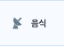 
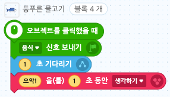
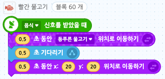   

<b>🧩 step4. </b> 펫 물 주기  
- 펫이 물을 마실 수 있도록 물뿌리개 스프라이트를 추가해줍니다.
- '물'이라는 신호를 만들고 물뿌리개를 클릭했을 때 물 신호를 보냅니다.
- 물을 주는 것 같은 효과를 주기 위해 물뿌리개 모양을 기울였다가 다시 원래 모양으로 바꿔줍니다.
- 펫이 물 신호를 받았을 때는 음식과 비슷한 방식으로, 물뿌리개 쪽으로 이동했다가 잠깐 기다린 후 원래 자리로 돌아오게 만들어 줍니다.  
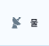 
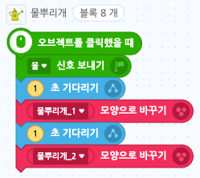
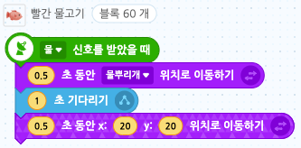  

<b>🧩 step5. </b> 펫 놀아주기  
- 펫을 놀아줄 수 있도록 공 스프라이트를 추가해줍니다.
- 공 스프라이트를 클릭했을 때 공 신호를 보냅니다.
- 공이 펫에 닿을 때까지 기다렸다가 닿으면 공이 위아래로 튕기도록 만들어줍니다.
- 펫이 공 신호를 받으면 공 쪽으로 갔다가 잠깐 기다린 후 원래 자리로 돌아오게 만듭니다.  
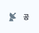 
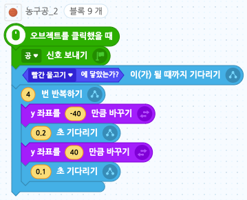
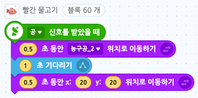  

<b>🧩 step6. </b> 펫이 뭐라고 말할까요?  
- 펫이 원하는 걸 말할 수 있도록 만들어봅시다.
- '원하는것'이라는 새로운 변수를 만듭니다. (안보이게 처리)
- 펫을 클릭했을 때 '원하는것'변수에 <b>1부터 3까지의 난수</b>를 넣어줍니다.
- 조건문으로, 만약 원하는 것이 1이면 음식을, 2면 물을, 3이면 놀기를 원하도록 만듭니다. 
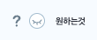 
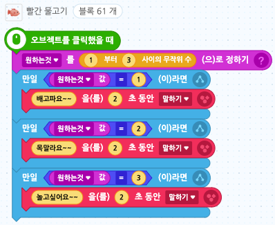  

<b>🧩 step7. </b> 얼마나 배고픈가요? 얼마나 목마른가요? 얼마나 심심한가요?  
- 배불러 변수, 심심해 변수, 목말라 변수를 만들어줍니다.
- 시작하기 버튼을 클릭했을 때 변수값이 모두 0에서 시작하도록 해줍니다.
- 배불러, 심심해, 목말라 값이 모두 3 이상이 되면 게임을 종료하도록 만들기 위하여 <b>~인 동안 반복하기</b> 블록을 사용해줍니다.
- 조건문의 조건은 세 변수가 3 미만인 동안만 조건문 안의 내용이 반복되도록 해줍니다.
- 조건을 만족하는 동안에는, 시작하기 버튼을 누른 후 5초 뒤에 배고픔 값이 -1이 되도록, 또 5초 뒤 목마름 값이 -1이 되도록, 또 4초 뒤 심심함 값이 -1이 되도록 해줍니다.
- 조건을 충족하지 않는 경우(모든 변수값이 2 이상인 경우)에는 반복을 중단해주고 펫의 크기를 키워줍니다.
- 그리고 음식신호를 받으면 음식을 먹었다는 뜻임으로 배불러 변수에 +1 해줍니다. 다른 신호도 마찬가지로 +1 해줍니다. 
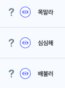
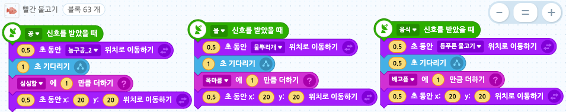
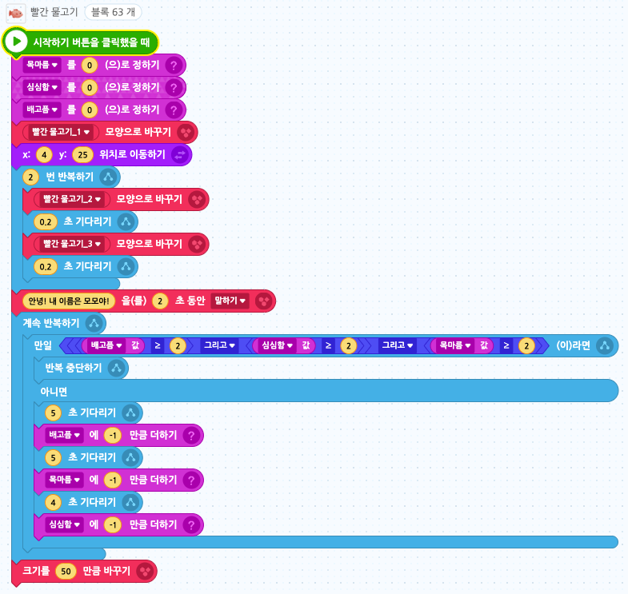
