# 15. 인형뽑기
<h3>15강 인형뽑기</h3>

🙂 이번 시간에는 집게를 움직여 인형을 뽑는 프로그램을 만들어봅니다.  
🚩 오브젝트 그리기, 좌표 이동, 다른 오브젝트의 좌표 따라가기, 오브젝트간의 상호작용에 대해 이해하고 활용할 수 있습니다.  
⇢ 오늘 만드는 애니메이션 완성본 
<a href="https://playentry.org/project/659e376402ef7500334fead8"> https://playentry.org/project/659e376402ef7500334fead8   
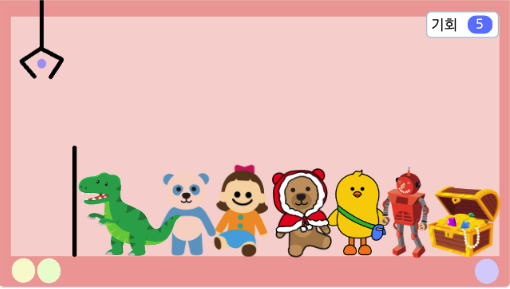   

<b>🧩 step1. </b> 배경 & 집게 그리기  
- 인형 뽑기 기계 느낌이 날 수 있도록 다양한 툴을 사용해 배경을 그려줍니다.
- 뽑은 인형을 놓을 수 있도록 왼쪽에 구분선을 그어줍니다.
- 배경을 다 그리고 오브젝트 이름을 배경이라고 저장해줍니다.
- 다음으로 집게를 그려줍니다. 집게 하나를 다 그리고 복제한 후, 집게가 잡은 모양으로 변경하여 하나 더 만들어줍니다.
- 이름을 '대기', '잡음'으로 저장해줍니다.
- 잡았다는 것을 판단할 수 있는 점을 하나 찍어 저장합니다. 이 점은 '캐치'라고 이름합니다.
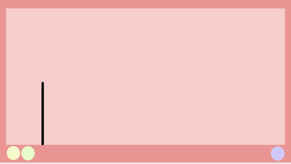 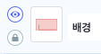 
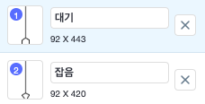  
 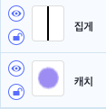  
- 모두 완성이 되면 다음과 같이 배치해줍니다. 
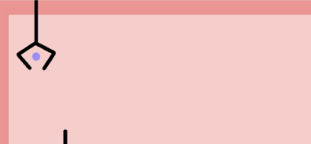   

<b>🧩 step2. </b> 인형 추가하기  
- 인형 뽑기에 사용할 인형 스프라이트들을 원하는만큼 추가해주고 인형들의 크기를 알맞게 조정합니다.
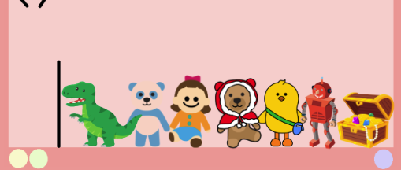  

<b>🧩 step3. </b> 집게와 캐치점 움직이기  
- 시작버튼을 눌렀을 때 집게의 시작위치를 정해줍니다.
- 시작할 때 기본 모양이 될 수 있도록 '대기'모양으로 바꿔줍니다.
- '계속 반복하기'와 조건문을 사용해서 집게가 오른쪽으로 움직일 수 있도록 코딩해줍니다.  
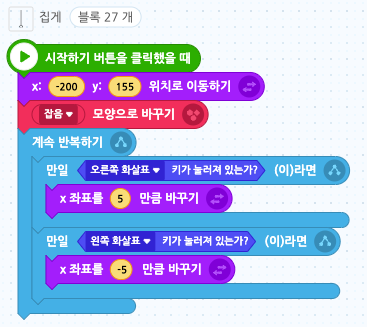 
- 사용자가 원하는 위치로 집게를 이동한 후 <b>스페이스 키를 눌렀을 때</b> 집게가 아래로 내려오고 인형을 잡는 모양으로 바꿉니다. 
- 그리고 위로 올라가서 원래 위치로 이동한 후 인형을 놓는 모양으로 바꿔줍니다. (실제 인형뽑기 기계가 어떻게 움직이는지 생각해보기) 
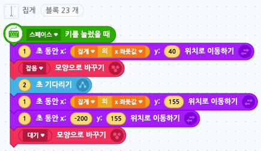 
- 마찬가지로 캐치점도 똑같이 코딩해줍니다.
- 이때, 집게와 캐치점의 y좌표는 다른 수 있으므로 실행시켜가며 맞추어줍니다.
- 또한 캐치점은 모양을 변경할 필요가 없습니다.  
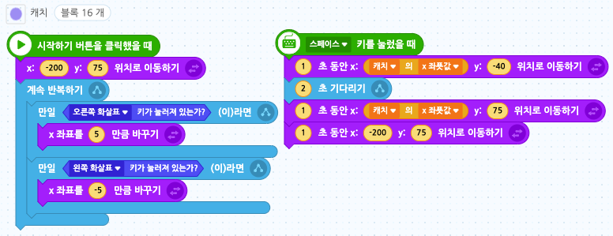  

<b>🧩 step4. </b> 인형 코딩하기  
- 시작버튼을 누를 때마다 인형이 무작위 위치에서 시작할 수 있도록 해 줍니다.
- 인형이 배경에 있는 검은 선 이후부터 화면 오른쪽까지 나타날 수 있도록 x좌표에 난수를 사용해 적절한 숫자를 적습니다. y좌표는 적당한 위치로 정해줍니다.
- 인형이 '캐치'점에 닿았으면 집게에 닿았다는 뜻이기 때문에 집게를 따라 움직일 수 있게 만들어줍니다. 
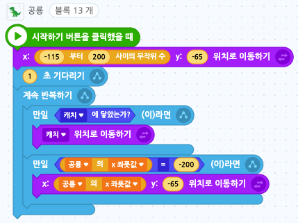 
- 이 코드를 복사해 나머지 인형에도 다 넣어줍니다. (인형의 크기에 따라서 x좌표, y좌표의 값을 변경해줘야 할 수도 있습니다.)  

<b>🧩 step5. </b> 기회 추가하기  
- 게임을 더 재미있게 만들기 위해서 사용자에게 인형을 뽑을 수 있는 기회를 딱 5번 주도록 하겠습니다.
- 그러기 위해서 '기회'라는 변수를 만들어줍니다. 
- 시작했을 때 변수의 기본값을 5로 정해줍니다. (변수 초기화)
- 스페이스 키를 누를 때마다 기회를 -1만큼 바꿔주고 기회가 0이 되면 게임을 멈춰줍니다. '모두 멈추기' 블록 사용. 
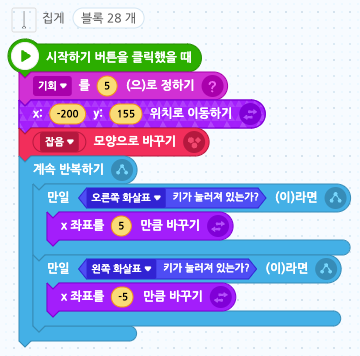   

<h3>🧸 하나만 잡는 인형뽑기 게임 (디벨롭 버전)</h3>

디벨롭 버전 완성본 링크 
<a href="https://playentry.org/project/65a8c6f3dfa753002ce006ee"> https://playentry.org/project/65a8c6f3dfa753002ce006ee   

- 한 번의 시도에 하나의 인형만 잡을 수 있는 게임을 만들어봅니다.
- 다른 코드는 고칠 필요 없이 인형들의 코드만 고쳐주면 됩니다.
- '한개만'이라는 변수를 추가해줍니다. 
  

- 아래는 기존 인형의 코드입니다.  
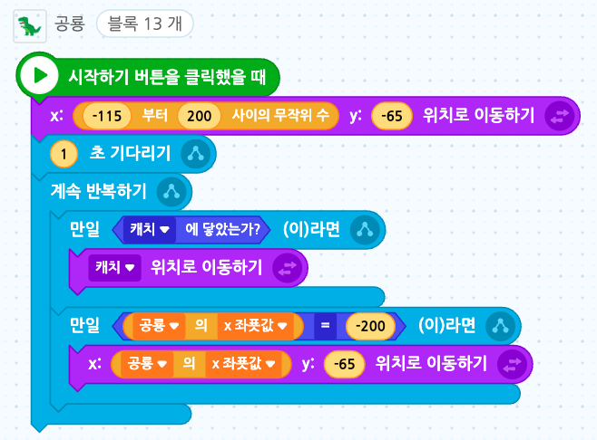  

- 인형이 '캐치'를 따라가는 경우는 '한개만' 변수가 0일 때입니다.
- '한개만'변수가 0이라서 인형이 '캐치'오브젝트를 따라가게 된다면, 그때 '한개만' 변수에 +1을 해줍니다.
- 그리고 인형의 x좌푯값이 -200이 될 때까지, 즉 집게가 제 자리로 갈 때까지 '캐치 위치로 이동하기'를 반복하여줍니다. (~때까지 반복하기가 끝나면 떨어질 수 있도록)
- 다시 '한개만' 변수 값을 0으로 초기화시켜줍니다. (기회가 5번이므로 다시 0으로 초기화)
- 이 변수는 사용자가 볼 필요가 없으므로 숨기기 블록을 사용하거나 눈 감기 버튼을 클릭해줍니다.  
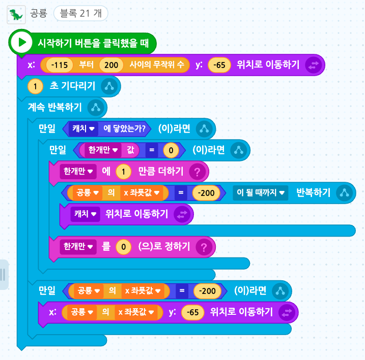
