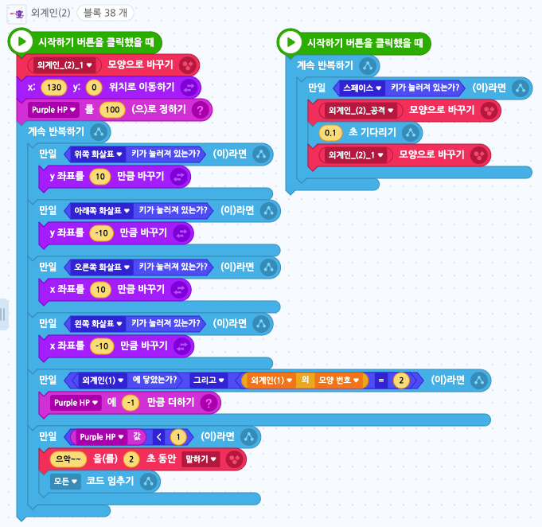

# 16. 2인 외계인 게임
<h3>16강 2인 외계인 게임</h3>

🙂 이번 시간에는 2인이 플레이 할 수 있는 게임을 만들어봅니다.  
🚩 한 오브젝트를 복제하고 이를 변형한 오브젝트를 추가한 후, 서로에게 공격하여 변수를 줄어들게 할 수 있으며 아이템을 추가하고 아이템을 통해 변수가 증가하게 만들 수 있습니다.  
⇢ 오늘 만드는 애니메이션 완성본 
<a href="https://playentry.org/project/659e49ac57d896002cfd4852"> https://playentry.org/project/659e49ac57d896002cfd4852   
   

<b>🧩 step1. </b> 준비하기  
- 마음에 드는 배경과 캐릭터 두 개를 추가합니다.
- 오브젝트 내에서 모양을 복제하고, 복제한 이미지에 공격하는 레이저를 그려줍니다. 
       
- 두 외계인을 위한 HP 변수를 두 개 만들어줍니다. 이때 기본값을 100으로 설정해줍니다.  
   

<b>🧩 step2. </b> 초록외계인 코딩하기  
- 왼쪽의 초록 외계인은 w,a,s,d 키로 움직이도록 하겠습니다.
- 처음 모양과 위치를 정해줍니다. 초록외계인의 HP 변수를 100으로 설정해줍니다. 
 
- 보라외계인에 닿았을 때, 보라외계인의 모양이 공격 모양이라면 HP를 -1씩 줄여줍니다. 
 
- 만약에 초록외계인의 HP가 0이 되면 게임을 종료합니다. 
 
- 위 코드들을 합쳐줍니다. 
  
- <b>외계인이 움직이면서 공격을 할 수 있도록 공격 코드는 따로 만들어줍니다.</b> 이 외계인은 f키로 공격을 하도록 하겠습니다.
- 공격을 할 때는 공격 모양으로 잠깐 바꾼 후 다시 돌아오게 만듭니다.  
  

<b>🧩 step3. </b> 보라외계인 코딩하기  
- 오른쪽의 보라외계인은 화살표 방향키로 움직이도록 하겠습니다. 공격은 스페이스 키를 눌러 합니다.
- 초록외계인의 코드를 복사&붙여넣기하고 필요한 부분을 수정해줍니다.  
  

<b>🧩 step4. </b> 아이템 코딩하기  
- 아이템으로 사용하고 싶은 스프라이트를 3개 추가하고 크기를 조정해줍니다.
- 게임이 시작하고 10초, 15초, 20초 후에 하나씩 나타나면서, 먹으면 HP가 10씩 늘어나도록 만들어줍니다. 
 
- 먼저 초시계를 시작시키고 숨겨놓습니다.  
 
- 첫번째 아이템 스크립트를 작성합니다. 타이머가 10보다 커질 때까지 기다리다가 무작위 위치에 나타나도록 만들어줍니다.
- 아이템을 어떤 외계인이 먹었는지 확인하고 HP를 늘려줍니다. (조건문) 
 
- 비슷한 방식으로 두 번째와 세 번째 아이템 스크립트도 완성해줍니다.  

  