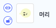
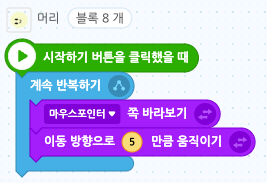

# 17. 애벌레 게임
<h3>17강 애벌레 게임</h3>

🙂 이번 시간에는 애벌레가 적을 피해 아이템을 먹으면서 점수를 얻는 게임을 만들어봅니다.  
🚩 오브젝트 그리기, 애벌레 모양대로 따라가기, 랜덤 움직이기, 랜덤 나타나기, 코드 멈추기 등을 사용할 수 있습니다.   
⇢ 오늘 만드는 애니메이션 완성본 
<a href="https://playentry.org/project/659f8f24180e5fd74c3a3ec1"> https://playentry.org/project/659f8f24180e5fd74c3a3ec1   
   

<b>🧩 step1. </b> 준비하기  
- 마음에 드는 배경을 추가하고 적과 아이템 오브젝트를 찾아 추가해 줍니다.  
  

<b>🧩 step2. </b> 애벌레 오브젝트 그리기  
- 애벌레 오브젝트는 직접 그려 추가해줍니다. 애벌레의 머리, 가슴, 배를 따로 따로 그려줍니다.  
- 다양한 툴을 사용해서 애벌레 머리를 그려줍니다. 오브젝트 이름을 '머리'로 변경하고 크기도 알맞게 변경해줍니다. 
    
- 애벌레 가슴에는 애니메이션 요소를 위해 다리도 그려줍니다.
- 애벌레가 움직일 때 다리가 움직이는 것처럼 보일 수 있도록 모양을 복제한 후 다리 위치를 조금 변경한 후 추가해줍니다.  
       
- 같은 방식으로 애벌레 배도 그려줍니다. 
     

<b>🧩 step3. </b> 애벌레 코딩하기  
- 시작하기 버튼을 클릭하면 애벌레 머리가 마우스를 따라다니게 만들어 줍니다.  
   
- 시작버튼을 눌러 애벌레 머리가 마우스를 잘 따라오는지 확인합니다.
- 마우스 포인터가 애벌레 머리에 닿으면 머리가 제자리에서 막 왔다갔다 움직입니다.
- 학생들에게 왜 그런지 생각해 보라고 하고 코드를 실행하면 머리가 어떻게 움직이는지 설명해 줍니다. 
 
- 앞서 언급한 문제를 해결하려면 머리가 마우스 포인터에 안 닿아있을 때만 움직여주도록 합니다. 
  
- 이제 애벌레 가슴을 코딩해 줍니다. 
- 애벌레 가슴은 애벌레 머리와 코드가 비슷하기 때문에 코드를 복사해서 가져올 수 있습니다. 
- 애벌레 가슴은 애벌레 머리 쪽을 보고 움직여야 합니다.  
  
- 비슷한 방식으로 애벌레 배의 코드도 작성해 줍니다.  
  
- 이때, 가슴은 다리가 움직이는 것처럼 보이도록 다음과 같이 코딩해줍니다.
- 움직이는 것과 모양이 바뀌는 것이 동시에 이루어져야 하므로 '시작하기 버튼을 클릭했을 때' 블록이 2개가 필요합니다. 
  

<b>🧩 step4. </b> 적 코딩하기  
- 적이 화면을 돌아다니게 만들어 봅시다.
- 적이 게임을 시작할 때마다 랜덤한 위치에서 시작할 수 있도록 무작위 위치에서 이동하기 블록을 사용합니다.
- 무한 반복하면서 움직이고, 벽에 닿으면 튕기게 합니다.
- 적이 다양한 각도록 움직일 수 있도록 방향의 값을 바꿔주세요. 

<b>🧩 step5. </b> 애벌레 잡기  
- 적이 애벌래에 닿았을 때 코드를 작성해 봅시다.
- '또는' 코드 블록 안에 '또는' 코드 블록을 넣어 여러 개의 조건을 한 번에 확인할 수 있습니다.
- 적이 애벌레에 닿으면 애벌레에게 잡았다는 신호를 보냅니다.
- 그리고 '잡았다!'라고 2초 동안 말합니다. 
    
- 애벌레를 잡은 경우, 적의 크기와 모양을 잠깐 바꾸는 효과를 줍니다.
  
- 애벌레는 잡혔다는 신호를 받으면 '으악~~'하고 2초동안 말합니다. 
  

<b>🧩 step6. </b> 아이템 코딩하기  
- 애벌레가 아이템을 먹으면 아이템이 사라졌다가 다시 새로운 위치에 나타날 수 있도록 만들어봅시다. 
- 아이템을 먹었을 때, '사과먹음'이라는 신호를 보냅니다.  
     
- 애벌레가 사과를 먹으면 머리에서 사과를 먹었을 때 신호를 받습니다. 사과를 먹었을 때 냠냠~ 이라고 말하게 만들어줍니다. 
  

<b>🧩 step7. </b> 점수 추가하기  
- 게임에 점수를 추가하기 위해서 변수를 사용해 줍니다.
- 애벌레가 아이템을 먹을 때마다 점수를 추가해 줍니다.
- 게임이 시작될 때마다 점수가 0으로 초기화 될 수 있게 0으로 정해줍니다.
- 그리고 애벌레가 아이템을 먹으면 점수에 1을 더합니다. ('사과먹음' 신호를 받았을 때)
- 애벌레가 적에게 닿으면 점수를 다시 0으로 초기화 해줍니다. ('잡힘' 신호를 받았을 때)  
      

<b>🧩 step8. </b> 게임 종료하기  
- 특정 점수에 도달하면 승리 메세지를 화면에 띄웁니다.
- 글상자를 추가하고 글씨의 크기나 위치 등을 조정합니다.
- 점수가 10점이 되면 게임을 승리하고 게임이 종료되도록 만들어줍니다.
- 승리 메세지는 처음에 게임이 시작할 때 화면에 보이지 않도록 숨겨줍니다.
- 점수가 10점이 될 때까지 기다리다가 보이게 해 줍니다.
- 게임을 끝내기 위해서 모든 코드 멈추기 블록을 사용합니다.  
    

🌏 더 어렵게 만들기 위해 <b>애벌레의 배를 몇 개 더 늘려주거나 적의 속도를 빠르게 </b>할 수 있습니다. 또는 <b>아이템의 개수를 늘려주는 방법</b>도 활용해볼 수 있다는 것을 알려줍니다.