# 18. 스네이크 게임
<h3>18강 스네이크 게임</h3>

🙂 이번 시간에는 아이템을 먹으며 몸이 길어지는 스네이크게임을 만들어봅니다.  
🚩 오브젝트 그리기, 랜덤 나타나기, 변수, 복제본 사용하기 등을 활용합니다.   
⇢ 오늘 만드는 애니메이션 완성본 
<a href="https://playentry.org/project/659faafdcb3c5e002600d68f"> https://playentry.org/project/659faafdcb3c5e002600d68f   
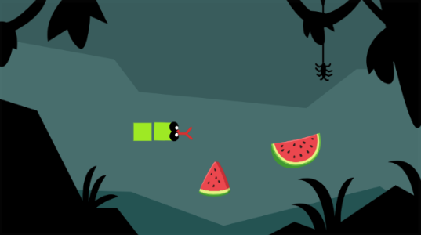   

<b>🧩 step1. </b> 준비하기  
- 마음에 드는 배경을 추가합니다. 
  
- 뱀 머리를 그려줍니다.  
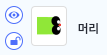  
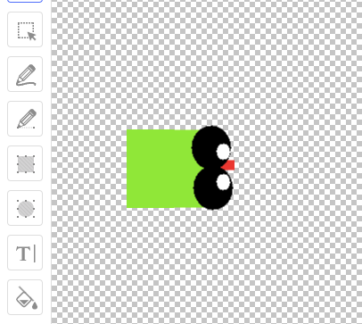   
- 뱀 몸통도 그려줍니다.
- 뱀 머리를 그렸던 네모를 복사해서 붙여넣기 한 후 크기를 정사각형으로 조절해주면 됩니다.  
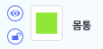 
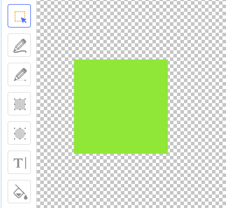  
- 뱀이 먹을 아이템을 추가해줍니다.
- 일반 아이템 하나와 보너스 아이템 하나, 총 두 개를 추가해줍니다. 
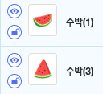  
- 그리고 게임을 위해 변수를 만들어 줍니다.
- 장면에는 보이지 않게 눈감기 체크박스를 클릭해줍니다. 
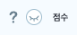  

<b>🧩 step2. </b> 혀 코딩하기  
- 처음 뱀 위치를 정해주고 계속 움직이도록 만들어줍니다.
- 벽에 부딪히면 게임이 종료되어야 하기 때문에 게임오버 신호를 추가하여 보내줍니다.  
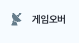 
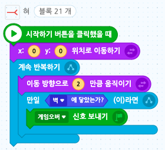  
- 뱀이 움직일 때 방향을 정해줄 수 있도록 화살표 키보드를 누르면 방향을 알맞게 정해줍니다.
- 방향만 바꿔주는 것이지 이동하는 것은 위 코드블럭에서 계속 2만큼 움직이고 있습니다.
- 따라서 방향키를 한 번만 눌러주면 됩니다. 
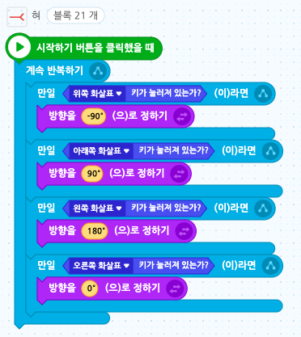  

<b>🧩 step3. </b> 뱀 머리 코딩하기  
- 뱀 머리가 혀를 따라다녀야 합니다.
- 뱀 머리가 혀보다 위에 올라오도록 오브젝트 목록에서 드래그하여 위로 올려줍니다.
- 뱀 머리가 혀를 따라다닐 수 있도록 '혀 위치로 이동하기'블록을 사용합니다.
- 하지만 혀와 함께 다니는 것이 아니라 따라다니는 것이기 때문에 조금 뒤에서 따라올 수 있게 오브젝트 크기에 따라 '0.1초 동안 혀 위치로 이동하기'를 사용합니다. 
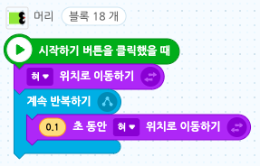  
- 뱀 머리는 혀와 같이 상하좌우가 있기 때문에 화살표 키에 따라 오브젝트가 보는 방향을 바꿔줍니다.
- '이동'과 '방향'이 동시에 이루어져야하므로 시작하기 버튼을 클릭했을 때 블록을 따로 사용합니다. 
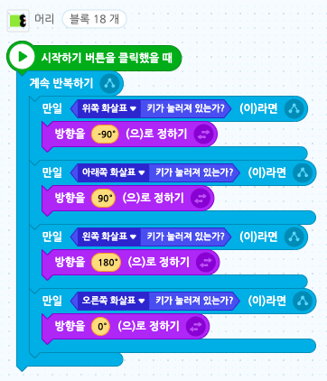  

<b>🧩 step3. </b> 뱀 몸통 코딩하기  
- 뱀 몸통은 머리를 따라다녀야 합니다.
- 뱀 몸통이 뱀 머리 위로 올라오지 않도록 오브젝트 목록에서 머리 아래로 드래그하여 내려줍니다.
- 그리고 뱀 몸통이 점점 길어질 수 있도록 '복제하기' 블록을 사용합니다.
- 우선 점수 변수는 숨겨주고 게임이 종료되면 변수가 보이도록 만들어줍니다. 
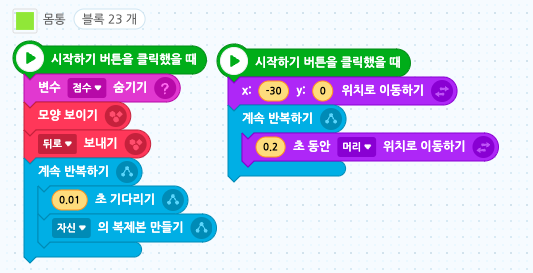  
- 뱀이 계속 길어지는 게 아니라 점수에 따라서 뱀이 점점 길어질 수 있도록 복제되었을 때 점수/5만큼 기다려준 후 복제본을 삭제합니다. 이렇게 하면 점수에 따라서 뱀의 길이가 달라집니다.
- 몸통이 만약에 혀에 닿으면 게임 오버 신호를 보내줍니다. 
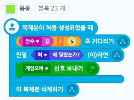  
- 게임 오버 신호를 받았을 때 뱀을 숨길 수 있도록 만들어 주고 총 몇점인지 변수를 보여줍니다. 그리고 게임을 모두 멈춰줍니다. 
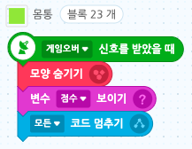  

<b>🧩 step4. </b> 아이템 코딩하기  
- 처음에 점수를 0으로 정해주고 아이템에 뱀의 혀가 닿으면 점수를 1만큼 바꿔줍니다. 그리고 아이템이 랜덤한 위치에 나타날 수 있도록 만들어줍니다.
- 아이템이 너무 벽 가까이 있으면 뱀이 아이템을 먹으려다 벽에 부딪혀 죽을 수 있기 때문에 벽과 너무 가깝지 않게 난수 범위를 설정해줍니다. 
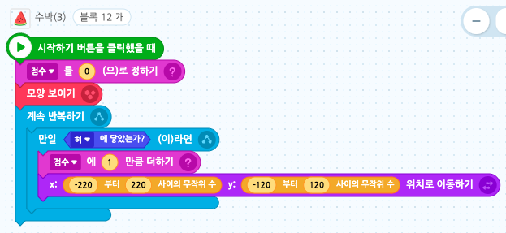  
- 아이템도 게임오버 신호를 받으면 숨겨줍니다.  
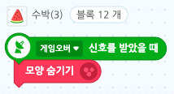  

<b>🧩 step5. </b> 보너스 아이템 코딩하기  
- 보너스 아이템은 가끔 나타나도록 만들어 줍니다. 우선 숨겨주고 10초마다 한 번씩 무작위 위치에 나타나도록 해줍니다.  
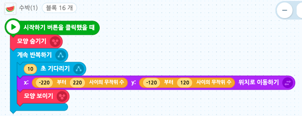  
- 뱀이 보너스 아이템에 닿으면 점수를 3점씩 늘려줍니다.  
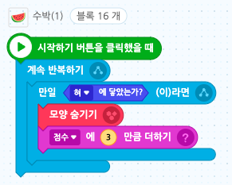  
- 마지막으로 게임오버 신호를 받으면 보너스아이템을 숨겨줍니다.  
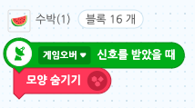  

<b>🧩 step5. </b> 다시하기  
- 게임이 끝난 후 '다시하기' 버튼을 넣어줍니다.
- 글상자를 추가합니다.
- 시작하기 버튼을 눌렀을 때는 보이지 않도록 숨김 처리를 해 줍니다.
- '게임오버'신호를 받으면 글상자를 꾸민 후 보이게 해줍니다.
- 그리고 글상자 오브젝트를 클릭하면 코드를 처음부터 다시 실행합니다.
- 코드를 처음부터 다시 실행하면 오브젝트를 눌렀다고 다시 글상자를 숨기는 코드를 작성하지 않아도 초기화되어 시작됩니다. 
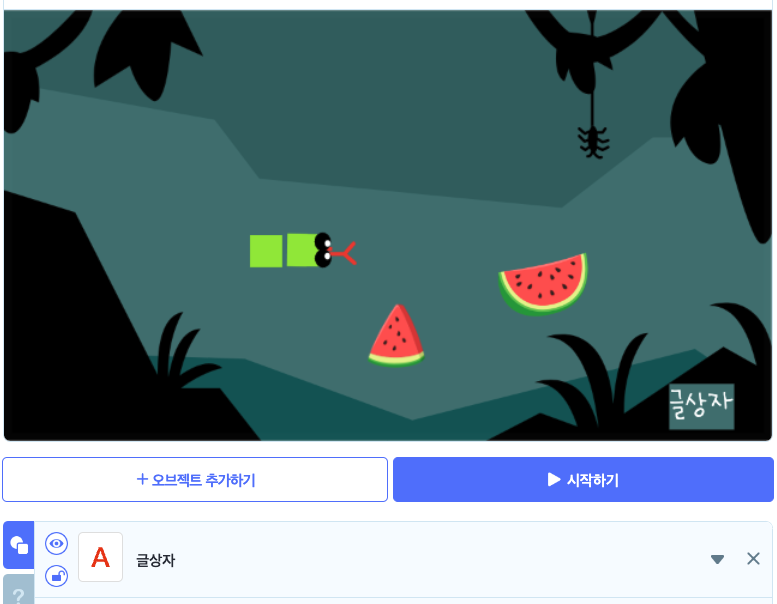 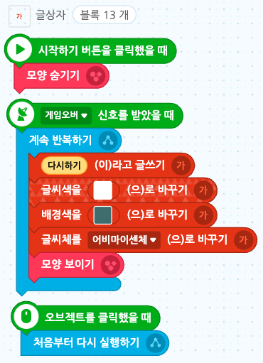