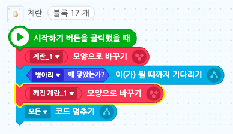
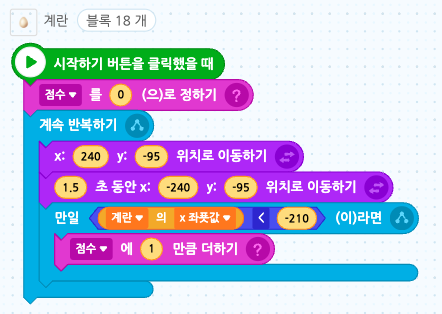

# 19. 점프 게임 ver.01
<h3>19강 점프 게임 ver.01</h3>

🙂 이번 시간에는 병아리가 계란을 뛰어넘는 점프게임을 만들어봅니다.  
🚩 점프 애니메이션을 만들 수 있습니다. 점수가 추가되는 조건을 생각해봅니다.   
⇢ 오늘 만드는 애니메이션 완성본 
<a href="https://playentry.org/project/65a0f8668d6586005c94d51f"> https://playentry.org/project/65a0f8668d6586005c94d51f  
  
⇢ 오늘 만드는 애니메이션 완성본 (업그레이드 버전) 
<a href="https://playentry.org/project/65a0fce71787a9c25de2df5d"> https://playentry.org/project/65a0fce71787a9c25de2df5d   

<b>🧩 step1. </b> 준비하기 & 점프하기  
- 맘에 드는 배경과 캐릭터, 장애물을 추가하고 크기를 알맞게 조정해줍니다.
- 시작하기 버튼을 클릭했을 때 캐릭터가 장면 왼쪽에 위치하도록 위치를 지정해줍니다.
- 스페이스키를 누르면 캐릭터가 점프할 수 있도록 조건문과 y좌표 이동을 이용하여 코딩해줍니다.
- 점프할 때마다 소리가 날 수 있게 해줍니다. 
  

<b>🧩 step2. </b> 장애물 움직이기  
- 장애물이 우에서 좌로 움직이도록 만들어봅니다.
- 시작하기 버튼을 누르면 장애물이 오른쪽 맨 끝으로 위치되고, 일정시간 동안 맨 왼쪽으로 이동하도록 합니다.
- 시간이 길수록 느리고 짧은 시간을 지정할수록 빠르게 움직입니다.  
  

<b>🧩 step3. </b> 게임 멈추기  
- 캐릭터가 장애물에 닿으면 게임이 멈추도록 만듭니다.
- 장애물이 망가진 모양을 이전에 추가한 장애물 오브젝트 내에 추가합니다.
- 처음 시작할 때 장애물의 모양을 정해주고, 만약 캐릭터에 닿으면 망가진 모양으로 바꿔줍니다.
- 그리고 게임이 멈추도록 모든 코드 멈추기 블록을 사용합니다. 
    

<b>🧩 step4. </b> 게임오버  
- 게임이 멈추면 화면에 게임 오버라는 글씨가 나타나게 만들어봅니다.
- 글상자를 추가하고 글꼴을 변경합니다.
- '게임오버' 신호를 추가합니다.
- 캐릭터가 장애물에 닿으면 게임오버 신호를 보내주게 합니다.
- 처음에는 글상자가 보이지 않게 하고, 신호를 받으면 보이게 만듭니다. 
      

<b>🧩 step5. </b> 다시하기  
- 다시하기 버튼 역할을 할 글상자를 추가합니다.
- '시작하기'버튼을 클릭했을 때는 보이지 않게 처리합니다.
- '게임오버'신호를 받으면 글상자를 꾸민 후 보이게 해 줍니다.
- 다시하기 글상자 오브젝트를 클릭하면 처음부터 코드를 다시 시작하게 해 줍니다. '처음부터 다시 실행하기' 블록 사용 
  
   

<b>🧩 step6. </b> 점수 추가하기  
- 캐릭터가 장애물을 뛰어넘을 때마다 점수를 올려봅니다.
- '점수'라는 변수를 만듭니다.
- 게임을 새로 시작할 때마다 0부터 시작할 수 있도록 시작 시 항상 0으로 초기화해줍니다.
- 장애물의 x좌표가 -210보다 작다는 것은 캐릭터가 장애물을 뛰어넘었다는 뜻이므로 점수를 1 올려줍니다.  
  

<h3> 💁🏻‍♀️ 업그레이드 버전 (레벨 추가)</h3>  

<b>🧩 step7. </b> 레벨 추가하기  
- 게임을 더 재미있게 만들기 위해 점수가 10점이 되면 레벨2로 넘어가도록 만들어줍니다.
- 글상자를 하나 추가하고 글꼴을 변경하여 줍니다.  
     
- 게임이 시작됐을 때 LEVEL 1 이라는 글이 2초간 나타나게 합니다.
- 점수가 10점이 되면 LEVEL 2 라는 글이 2초간 나타나게 하고, LEVEL2 신호를 만들어 보냅니다.  
  
   
- 레벨2가 되면 배경도 바꿔줍니다.
- 기존 배경 안에 다른 배경을 하나 더 추가해줍니다.
- 시작하기 버튼을 누르면 첫 번째 모양으로, level2 신호를 받으면 다음 배경으로 바뀌도록 합니다.  
 
 
   

- 20점이 되면 you win을 표시합니다.
- you win 신호를 추가하고 20이 되면 신호를 보냅니다.
- 기존에 GAME OVER를 표시하던 글상자가 you win 또는 game over를 표시할 수 있도록 다음과 같이 변경하여 줍니다.
- you win 신호를 받으면 you win 글상자를 표시하고 모든 코드를 멈춰줍니다. 

   

<b>🧩 step8. </b> 장애물 추가하기  
- 레벨이 바뀌면 장애물이 하나 더 추가되도록 만들어 봅니다.
- 기존에 있던 계란 오브젝트를 복제합니다. 복제하기를 클릭하면 안의 코드블럭돌도 함께 복사됩니다. 
- 복제된 코드블록을 약간 바꿔줍니다. 
- 우선 레벨1일 때는 안 보이게 숨겨줍니다.
- 레벨 2로 바뀌면 첫번째 계란과 겹치지 않는 속도, 시간차로 나오도록 n초 기다리기 블록을 사용해줍니다.
- n초 기다린 후 모양을 보이게 한 후 다음 블록은 같습니다.  

 

