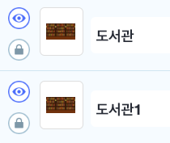
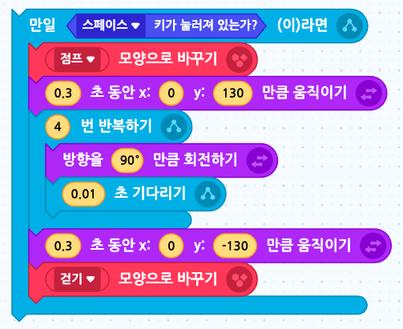

# 20. 점프 게임 ver.02
<h3>20강 점프 게임 ver.02</h3>

🙂 이번 시간에는 배경이 움직이게 만들고, 다양한 방법으로 장애물을 피하게 해봅니다.  
🚩 회전하며 점프하거나, 슬라이드하는 애니메이션을 만들 수 있습니다. 장애물에 닿을 때마다 목숨이 줄어들도록 변수를 사용하고, 타이머를 사용해 이동한 거리를 표시합니다.  
⇢ 오늘 만드는 애니메이션 완성본 
<a href="https://playentry.org/project/65a49a4059ff4e002c8b09a0"> https://playentry.org/project/65a49a4059ff4e002c8b09a0  
   

<b>🧩 step1. </b> 움직이는 배경 만들기  
- 맘에 드는 배경을 추가합니다.
- 배경이 오른쪽에서 왼쪽으로 움직일 수 있도록 코드를 만들어봅니다.
- x좌표를 -3만큼 이동하기를 무한반복합니다.
- 배경의 x좌표가 -480이라면 왼쪽으로 사라진 상태이기 때문에, 다시 오른쪽 끝으로 갈 수 있도록 배경의 x좌표를 480으로 설정해줍니다. 
  
- 하지만 배경이 움직일 때 빈 화면이 보이는 것을 확인할 수 있습니다.
- 그래서 배경을 두 개 이어주어야 합니다.
- 기존 배경 오브젝트를 <b>복제</b>하고 조금만 수정해줍니다.
- 이 배경 오브젝트는 시작점을 (0,0)이 아닌 (480, 0)으로 설정해줍니다.
- 똑같이 x좌표를 -3만큼 바꿔주면서, 역시 배경의 x좌표가 -480이 되면 (480, 0)으로 이동하게 해줍니다. 
   

<b>🧩 step2. </b> 캐릭터와 변수 추가하기  
- 달리기 할 캐릭터를 추가해줍니다.
- 달리는 모양, 점프하는 모양, 슬라이드 하는 모양이 필요합니다.
- '거리', '생명' 변수를 추가해줍니다. 거리는 0으로, 생명은 5로 초기화해줍니다.
- 캐릭터가 시작할 때 위치하는 지점을 설정합니다. ex. (-180, -55)
- 이때 거리는 캐릭터가 말해주기 위해 변수를 숨겨줍니다. 

   

<b>🧩 step3. </b> 거리 표시하기  
- 거리를 구하기 위해서 사실은 타이머를 사용합니다.
- 소수점이 나오지 않도록 반올림을 사용합니다.
- 몇 미터를 달렸는지 말할 수 있도록 변수와 '말하기'를 결합하여 표시합니다.  
   

<b>🧩 step4. </b> 캐릭터 움직이기  
- 캐릭터는 점프, 슈퍼점프, 슬라이드를 할 수 있습니다.  
- 먼저 위쪽 화살표를 눌렀을 때 캐릭터가 점프하게 해줍니다.
- y좌표를 빠르게 키웠다가 줄이는 것으로 점프를 표현합니다.  
  
- 스페이스키를 눌렀을 때 슈퍼점프를 합니다.
- 점프 사이에 캐릭터가 한 바퀴 돌 수 있도록 4번 반복하면서 90도 돌아줍니다. 
  
- 아래쪽 화살표를 누르면 슬라이드를 합니다.
- 슬라이드 하는 모양으로 바꿔줍니다. 
  
- 다음은 현재까지 만들어진 코드입니다.  
   

<b>🧩 step5. </b> 돌맹이 장애물 추가하기  
- 장애물 오브젝트를 추가합니다.
- 장애물은 계속 나와야하기 때문에 '자신의 복제본 만들기' 블록을 사용합니다.
- 장애물을 장면 오른쪽에 위치시키고 숨긴 후, '1~5 무작위 수'초 기다렸다가 나오게 합니다. 
   
- 복제되었을 때 보이게 하고, 장애물이 왼쪽으로 계속 이동하게 합니다. 왼쪽 벽에 닿을 때까지 또는 장애물이 끝까지 움직였을 때까지 x좌표를 -7만큼 바꿔 움직이게 합니다.
- 장애물이 캐릭터에 닿으면 닿았다는 신호를 보내고 사용한 복제본은 삭제해줍니다. 
- 캐릭터에 닿지 않았어도 왼쪽벽에 닿아도 복제본을 삭제합니다. 
  
  

<b>🧩 step6. </b> 장애물 추가하기  
- 새 장애물도 돌맹이 장애물과 비슷하게 코딩합니다.
- 이 장애물을 돌맹이 장애물보다 덜 나올 수 있도록 5~10초 사이만큼 기다렸다가 나타나게 해줍니다. 
   
- 책 문양이 보일 수 있도록 복제되었을 때 무한 반복하면서 다음 모양으로 바꾸기 블록도 추가해줍니다. 
  

<b>🧩 step7. </b> 장애물에 부딪혔을 때  
- 캐릭터가 장애물에 부딪힌 신호를 받으면 목숨을 -1 줄여줍니다. 
  

<b>
[level up]  
- 속도가 제각각 다른 장애물들을 추가해봅니다. 
- 생명을 +1할 수 있는 아이템을 추가해봅니다. 
- 레벨을 추가해봅니다.  
- 다시하기 버튼 등을 만들어봅니다.
</b>