# 21. 벽돌깨기
<h3>21강 벽돌깨기</h3>

🙂 이번 시간에는 패들로 공을 받아가며 벽돌을 깨는 게임을 만들어봅니다.  
🚩 복제본을 사용하여 벽돌을 생성할 수 있고, 공이 벽돌에 닿았다는 조건문을 활용해 복제본을 삭제할 수 있습니다.   
⇢ 오늘 만드는 애니메이션 완성본 
<a href="https://playentry.org/project/65a4c851db6c7c006243ca2a"> https://playentry.org/project/65a4c851db6c7c006243ca2a  
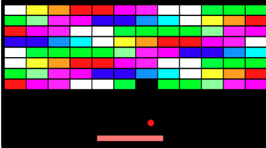   

<b>🧩 step1. </b> 오브젝트 추가하기  
- 배경, 패들, 공, 벽돌을 '오브젝트 추가하기 > 새로 그리기'를 통해 만들어줍니다. 
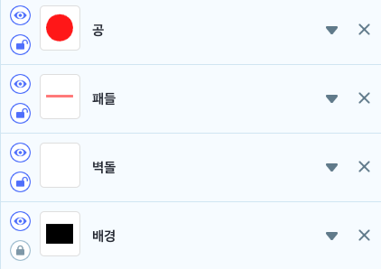    

<b>🧩 step2. </b> 벽돌 만들기  
- 벽돌을 적절한 위치에 위치시켜줍니다.
- 벽돌의 크기에 따라 적절한 수만큼 반복하며 복제본을 만듭니다.
- '벽돌개수' 변수를 만들어 벽돌 개수를 셉니다. (사용자에게 알려줄 필요가 없기 때문에 숨겨줍니다.)
- 한 줄을 다 채우고나면, x좌표 원위치로 돌아가고, 한 단 내려가기 위해 y좌표를 적당한 크기만큼 내려줍니다. 
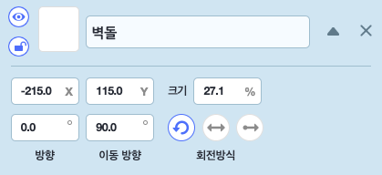      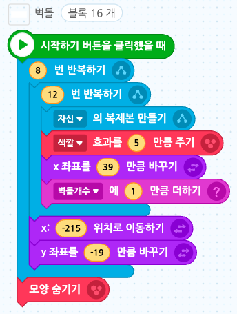   
- 복제본이 만들어지고, 벽돌이 공에 닿으면 그 벽돌이 사라지도록 복제본을 삭제해주고, 벽돌 개수를 하나 줄여줍니다. 
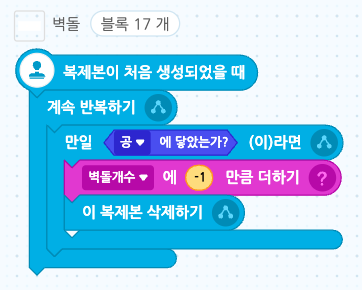  

<b>🧩 step3. </b> 패들 코딩하기  
- 패들이 오른쪽 벽을 넘어가기 전까지, 즉 x좌표가 240이하라면 오른쪽 화살표를 눌렀을 때 패들이 x좌표가 10만큼 바뀌게 해줍니다.
- 패들이 왼쪽 벽을 넘어가기 전까지, 즉 x좌표가 -240이상이라면 왼쪽 화살표를 눌렀을 때 패들이 x좌표가 -10만큼 바뀌게 해줍니다. 
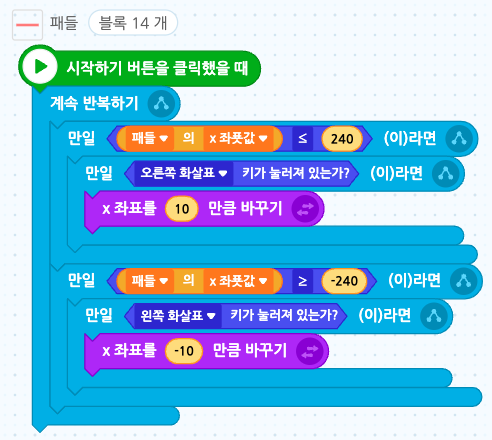  

<b>🧩 step4. </b> 공 코딩하기  
- 공의 방향을 쉽게 계산하기 위해 오브젝트 리스트에서 방향, 이동방향을 0으로 초기화합니다.
- 시작하기 버튼을 클릭했을 때, 방향을 '-60부터 60 사이 무작위' 방향으로 정해지게 합니다.
- 블록이 다 나타나기까지 약 2초간 기다렸다가 이동방향으로 3만큼 움직이기를 계속 반복합니다.
- 화면 끝에 닿으면 튕기게 합니다.
- 만일 공이 <b>패들</b>에 닿으면, 다시 방향을 '-60부터 60만큼 무작위'로 튕겨지게 합니다.
- 만일 공에 <b>벽돌</b>에 닿으면, 방향을 '180 - 공의 방향' 으로 정합니다. 
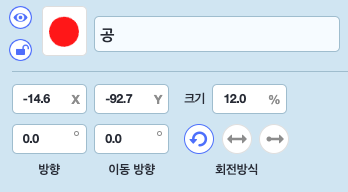 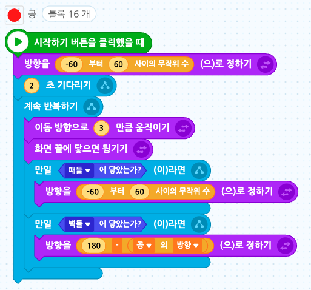   

<b>🧩 step5. </b>  
- 글상자를 추가합니다. 
- 'you lose', 'you win' 외에는 표시하지 않아도 되므로 보이지 않게 눈감기 버튼을 클릭해줍니다.
- '게임시작', '게임종료' 신호를 추가합니다.
- 벽돌이 모두 생성된 후 게임시작 신호를 보내고, 만일 공이 아래쪽 벽에 닿았을 때에는 게임종료 신호를 보냅니다. 
  
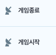  
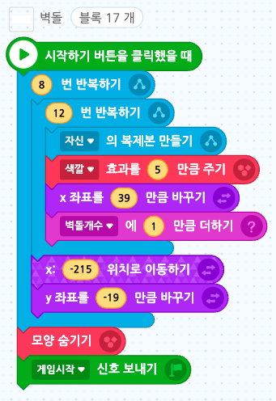  
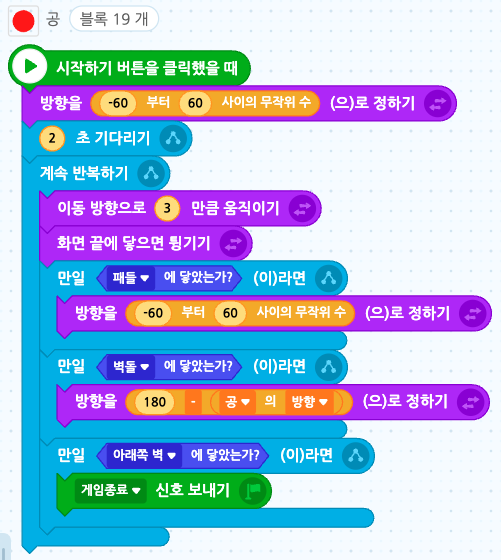   
- 글상자는 게임시작 신호를 받았을 때 계속 기다리다가, 벽돌개수가 0개, 즉 모든 벽돌을 없앴을 때 YOU WIN이라고 쓴 글상자가 보이게 하고 모든 코드를 멈춰줍니다.
- 게임종료 신호를 받으면, YOU LOSE라는 글상자를 보이게 한 후 모든 코드를 멈춥니다.  
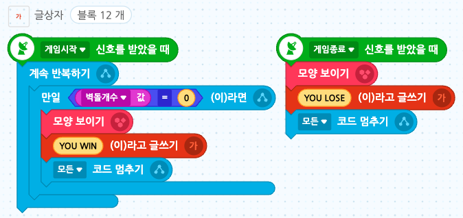
  