# 22. 전투기 슈팅게임
<h3>22강 전투기 슈팅게임 </h3>

🙂 이번 시간에는 슈팅게임을 만들어봅니다.  
🚩 변수, 신호, 복제본 등 다양한 요소를 활용해 게임을 완성할 수 있습니다. 변수를 활용해 공격과 체력을 계산하고 복제본을 사용해 미사일을 구현할 수 있습니다.   
⇢ 오늘 만드는 애니메이션 완성본 
<a href="https://playentry.org/project/65a4d80d4ba9820025829e5c"> https://playentry.org/project/65a4d80d4ba9820025829e5c  
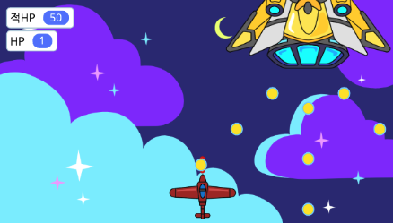   

<b>🧩 step1. </b> 오브젝트 추가하기  
- 배경과 전투기 두 개를 추가합니다.
- 내 전투기가 방향키에 따라 움직이도록 '~키를 눌렀는가' 조건문을 사용하여 설정해줍니다.  
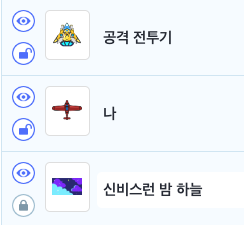   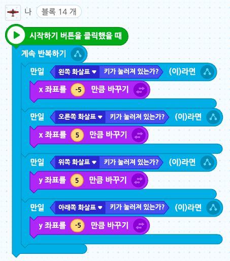  

<b>🧩 step2. </b> 변수 추가하기  
- HP를 보여줄 변수를 추가합니다. (내 전투기의 HP를 보여줄 'HP', 적 전투기의 HP를 보여줄 '적 HP') 
- 내 전투기는 기본값을 5로, 적 전투기는 기본값을 50으로 설정해줍니다.  
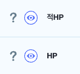 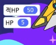   

<b>🧩 step3. </b> 적 전투기 이동시키기  
- '이동방향'이라는 변수를 추가하고 기본값을 '오'라고 설정합니다.
- 이동방향이 오른쪽이면 계속해서 쭉 오른쪽으로 이동하도록, 이동방향이 왼쪽이면 계속해서 쭉 왼쪽으로 이동하도록 합니다. 
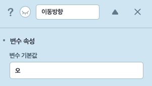 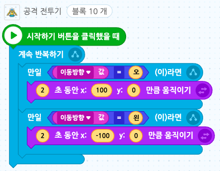   
- 이 경우 화면 밖으로 나가버리기 때문에, 오브젝트가 140이상이거나 -140이하이면 이동방향을 반대로 바꾸도록 합니다.
- 적 전투기는 '이동방향' 변수값에 따라 이동하기 때문에, 오브젝트의 x좌표가 140이 이상이 되면 변수값을 '왼'으로 바꾸어 적 전투기가 왼쪽으로 이동하도록 합니다.
- 반대로 오브젝트의 x좌표가 -140 이하면 변수값을 '오'로 바꾸어 적 전투기가 오른쪽으로 이동하도록 합니다. 
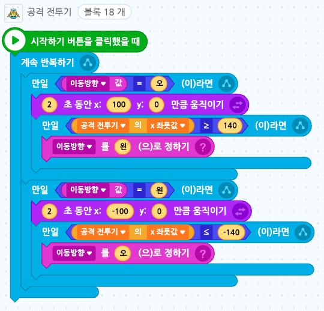  

<b>🧩 step4. </b> 미사일 발사하기  
- 미사일 모양을 그려줍니다. (오브젝트 추가하기 > 새로 그리기)
- 미사일이 내 전투기를 따라다닐 수 있게 '~ 위치로 이동하기' 블록을 사용합니다.
- <b>이때, 내 전투기의 중심점을 앞으로 변경해주어야 미사일이 내 전투기의 앞에 위치합니다.</b> 
 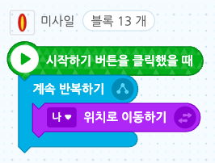   
- 그리고 스페이스키를 누르면 자신의 복제본을 만들어줍니다.
- 만들어진 복제본은 y좌표를 10만큼 바꾸기를 반복하며 위로 쭉 올라갑니다.
- 미사일이 위쪽 벽에 닿거나 공격전투기에 닿으면 생성된 복제본을 삭제해줍니다.
- 미사일이 공격전투기에 닿으면 적hp 변수를 1 줄여줍니다.  
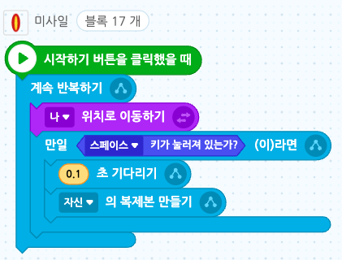 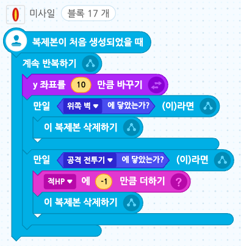   

<b>🧩 step5. </b> 적 미사일 발사하기  
- 적 미사일을 그려줍니다. (오브젝트 추가하기 > 새로 그리기)
- 적 미사일이 공격 전투기를 따라다닐 수 있게 '~ 위치로 이동하기 블록을 사용합니다.'
- 이때, 적 미사일이 보이지 않도록 오브젝트 목록에서 미사일을 전투기보다 아래로 위치하도록 드래그해줍니다.
- (모양> 뒤로 보내기 블록을 사용할 수도 있습니다) 
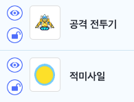 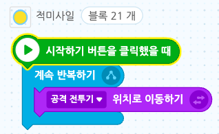   
- 적 미사일 발사 신호를 추가합니다.
- 공격전투기에서 2초마다 적 미사일 발사 신호를 보내게 합니다. 
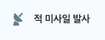   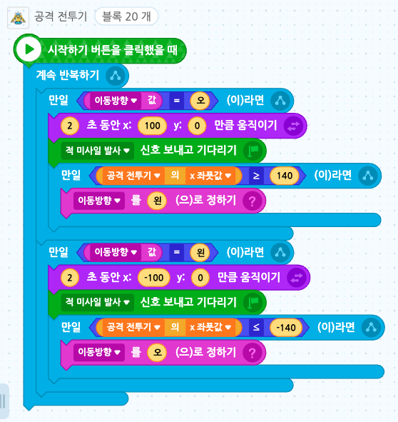   
- 적 미사일 발사 신호를 받으면, 총 4번 미사일을 쏘게 합니다.
- 이동방향을 135로 정하고, 한 번 미사일을 쏠 때 3개가 발사되도록 3번 반복하기 블록을 사용합니다.
- 쏠 때 자신의 복제본을 만들고 45도 회전합니다.
- 만들어진 복제본은 이동방향으로 20만큼 움직이고, 만약 벽이나 내 전투기에 닿으면 복제본이 사라지게 되며, 내 전투기에 닿으면 HP가 -1 됩니다. 
- 신호를 받았을 때 0.3초 기다리기 블록은 4번의 미사일 발사 사이의 간격을 정합니다. 0.3보다 큰 수를 쓰면 미사일이 천천히 4번 발사됩니다.
- 복제본이 생성되었을 때 쓰이는 0.1초 기다리기 블록은 미사일의 속도를 정합니다. 0.1보다 작은 수를 쓰면 미사일이 더욱 빠르게 발사됩니다. 
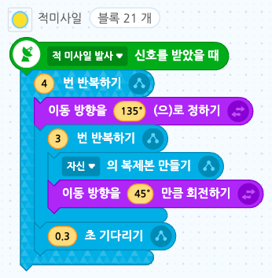 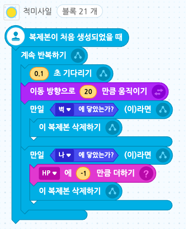   