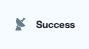

# 23. 벽돌깨기ver02
<h3>23강 벽돌깨기ver02</h3>

🙂 이번 시간에는 벽돌깨기 게임을 디벨롭하여, 레벨에 따라 여러 이벤트를 넣어봅니다.  
🚩 복제본을 사용하여 벽돌을 생성할 수 있고, 공이 벽돌에 닿았다는 조건문을 활용해 복제본을 삭제할 수 있습니다.  
🚩 레벨에 따라 공의 속도, 벽돌의 크기, 공의 갯수 등을 다르게 구현할 수 있습니다.   
⇢ 오늘 만드는 애니메이션 완성본 
<a href="https://playentry.org/project/65aa1085a5b201002c738553"> https://playentry.org/project/65aa1085a5b201002c738553  

<b>🧩 step1. </b> 21강 벽돌깨기 ver01 에서 만들어본대로 기본적인 벽돌깨기 게임을 만들어봅니다.  
- 필요한 오브젝트를 추가합니다. (벽돌, 패들, 공)
- 필요한 속성들을 추가합니다. (변수: 벽돌개수, 신호: 게임종료/게임시작) 
 
 
 
 
  

<b>🧩 step2. </b> 레벨을 표시하고 다시하기 버튼을 추가합니다.  
- 다시하기, 레벨 글상자를 추가합니다. 
 
- 시작하기 버튼을 클릭했을 때는 보이지 않게 해주고 게임 종료 신호를 받으면 '다시하기'라는 글을 보이게 하며 모든 코드를 종료합니다.
- 다시하기 글상자 오브젝트를 클릭하면 처음부터 다시 실행합니다. 
  
- 레벨 블록도 시작하기 버튼을 클릭했을 때는 보이지 않게 해줍니다.
- 벽돌 블록은 벽돌이 다 만들어진 후 게임시작 신호를 보내는데, 레벨 글상자가 그 신호를 받으면 2초간 보였다가 사라지게 해줍니다. 
 

<b>🧩 step3. </b> 장면을 복제합니다.  
- level1으로 장면 이름을 바꿔주고, 장면을 복제하여 level2로 이름을 설정합니다.
- 장면을 복제하면 오브젝트, 코드가 모두 똑같이 복제됩니다.
- levle1 장면에서 벽돌개수 값이 0이 되면(조건문) level2 장면을 시작하게 합니다. 
 
  

<b>🧩 step4. </b> levle2 장면  
- level2 장면의 배경을 바꿔줍니다.
- 모든 '시작하기 버튼을 클릭했을 때' 블록을 '장면이 시작되었을 때'로 바꿔줍니다. 
 

 
 
  
- 난이도를 높여주기 위해 벽돌의 크기를 줄이고 색을 바꿔줍니다.
- 벽돌의 크기가 줄어든만큼 반복횟수와 x좌표, y좌표를 바꾸는 크기를 바꿔줍니다. 
- 화면을 다 채우려면 벽돌의 크기가 줄어들었으니 x좌표, y좌표 이동하는 크기는 줄어들고, 반복횟수는 늘어납니다. 
  
- 공의 속도를 높이기 위해 '이동방향으로 N만큼 움직이기'의 수를 키워줍니다.
- 또 장면을 복제해주고 벽돌 개수 값이 0이 되면(조건문) level3로 이동하도록 합니다. 
 
  

<b>🧩 step5. </b> levle3 장면  
- leve2에서 벽돌의 크기를 줄이고 갯수를 늘리고, 공의 속도를 높였다면,
- level3에서는 공의 속도를 다시 느리게 해주고 그 대신 공의 개수를 늘려줍니다.  
- 장면이 시작되었을 때 배경을 바꿔줍니다.
- 벽돌의 크기는 같게 하고 색깔만 바꿔줍니다.
- 레벨 글상자와 다시하기 글상자의 블록은 동일합니다. (LEVEL2 -> LEVEL3) 
 
 
 
  
- 모든 맵을 깼을 때 표시하기 위해 Success 신호를 추가합니다.
- level3에서 벽돌개수 값이 0이 되면 success 신호를 보내도록 합니다. 
 
  
- '성공' 글상자를 추가합니다.
- 장면이 시작되었을 땐 숨겼다가 success 신호를 받으면 'SUCCESS!!'를 표시하도록 합니다.
- 그리고 모든 코드를 멈춰줍니다. 
  
