# 24. 전투기 슈팅게임ver02
<h3>24강 전투기 슈팅게임ver02 </h3>

🙂 이번 시간에는 슈팅게임을 만들어봅니다.  
🚩 변수, 신호, 복제본 등 다양한 요소를 활용해 게임을 완성할 수 있습니다. 변수를 활용해 공격과 체력을 계산하고 복제본을 사용해 미사일을 쉽게 구현할 수 있습니다.   
⇢ 오늘 만드는 애니메이션 완성본 
<a href="https://playentry.org/project/65aa280dbaf8da002cafbd87"> https://playentry.org/project/65aa280dbaf8da002cafbd87  

<b>🧩 step1. </b> 오브젝트 추가하기  
- 필요한 오브젝트와 변수들을 추가합니다.
- 내 전투기, 적 전투기, 아이템, 배경, 내 미사일(그리기), 적 미사일(그리기), 내HP 변수, 적HP 변수 
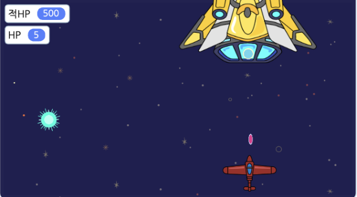  

<b>🧩 step2. </b> 내 전투기 코딩하기  
- 내 전투기가 방향키로 움직일 수 있도록 해줍니다.
- 내 HP는 5로 초기화해줍니다. 
- 이때, 전투기가 아래로 사라질 수 없도록 전투기의 y좌표가 -80이상인 경우에만 아래로 움직이는 것이 가능하게 해줍니다. 
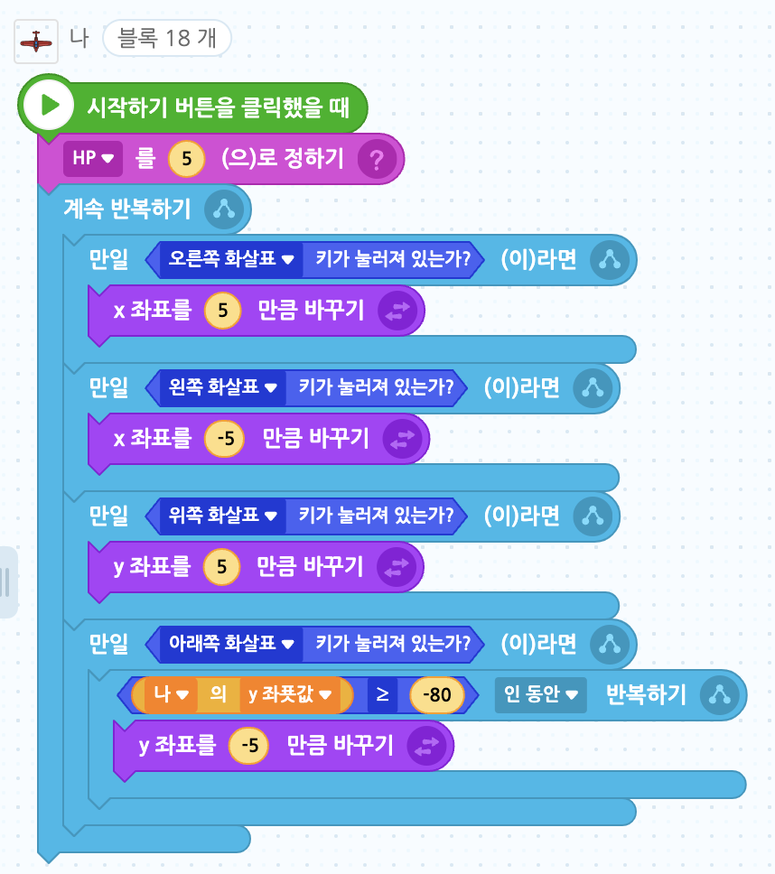  

<b>🧩 step3. </b> 적 전투기 코딩하기  
- 적 HP는 500으로 초기화합니다.
- 이전 버전은 규칙적으로 2초마다 오/왼으로 움직이며 벽에 닿으면 튕기게 했지만 이번에는 랜덤한 속도로 랜덤한 위치로 이동할 수 있도록 합니다.
- '적 미사일 발사' 신호를 추가해줍니다.
- 공격전투기는 랜덤한 속도로 랜덤한 위치로 이동하며 신호를 보냅니다. 
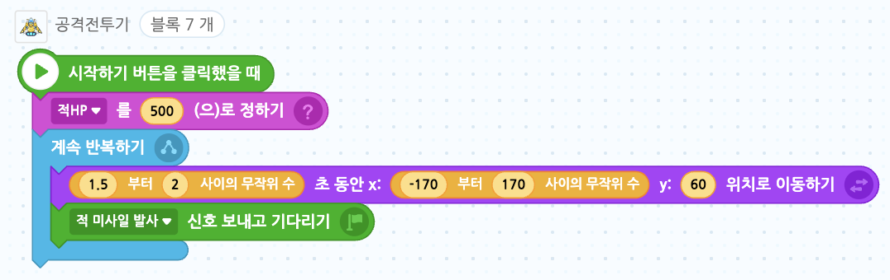  

<b>🧩 step4. </b> 적 미사일 코딩하기  
- 시작과 동시에 적 전투기의 위치를 따라가게 합니다.
- 적 미사일 신호를 받으면 미사일을 3개씩 0.3초 간격으로 5번 미사일을 발사하도록 복사본을 만들어줍니다.
- 복사본은 벽 또는 내 전투기에 닿으면 사라지게 해주고, 내 전투기가 미사일에 닿으면 HP가 -1 되고 적절한 소리가 나게 해 줍니다. 
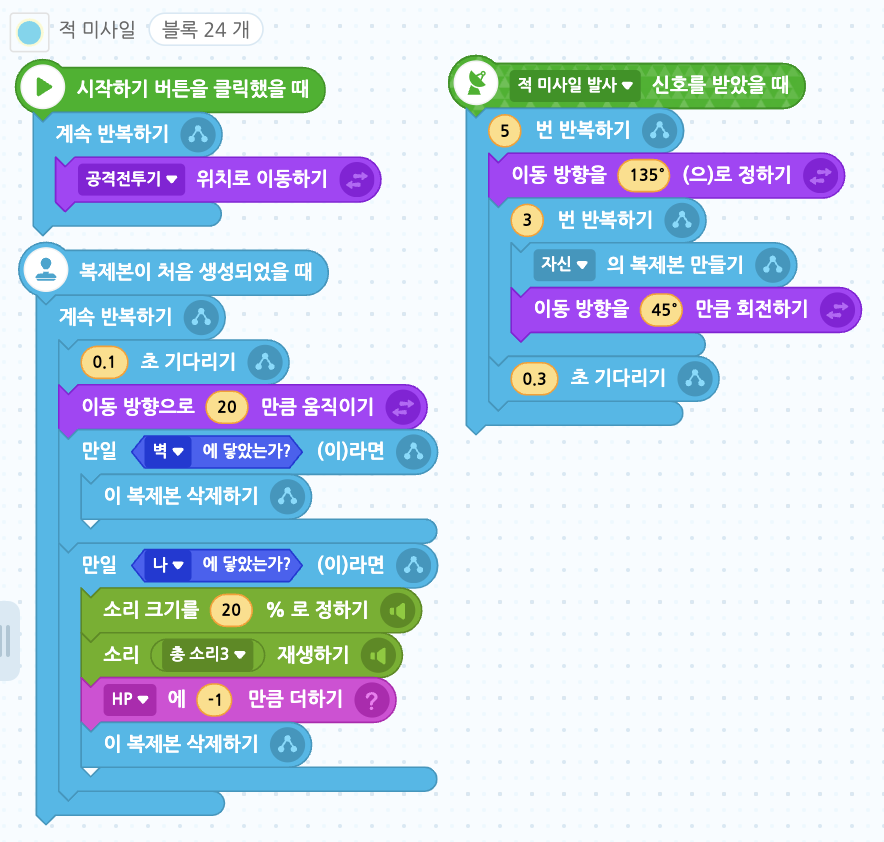  

<b>🧩 step5. </b> 내 미사일 코딩하기  
- '공격력' 변수를 추가하고 변수값을 -1로 초기화합니다.(레벨에 따라 공격력을 다르게 해 줄 예정)
- 시작하기 버튼을 누르면 내 미사일이 내 전투기를 따라다니도록 해줍니다. 이 때 내 전투기의 중심점을 중앙에서 앞으로 위치시켜줍니다.
- 스페이스키를 누르면 미사일이 나가게 하도록 복제본을 만들어줍니다.
- 스페이스키를 누르면 미사일이 나가고 벽이나 전투기에 닿으면 삭제시켜줍니다.
- 이때, 미사일이 전투기에 닿으면 적 HP 변수가 공격력 변수 값(현재 -1)만큼 바뀌도록 해 줍니다. 
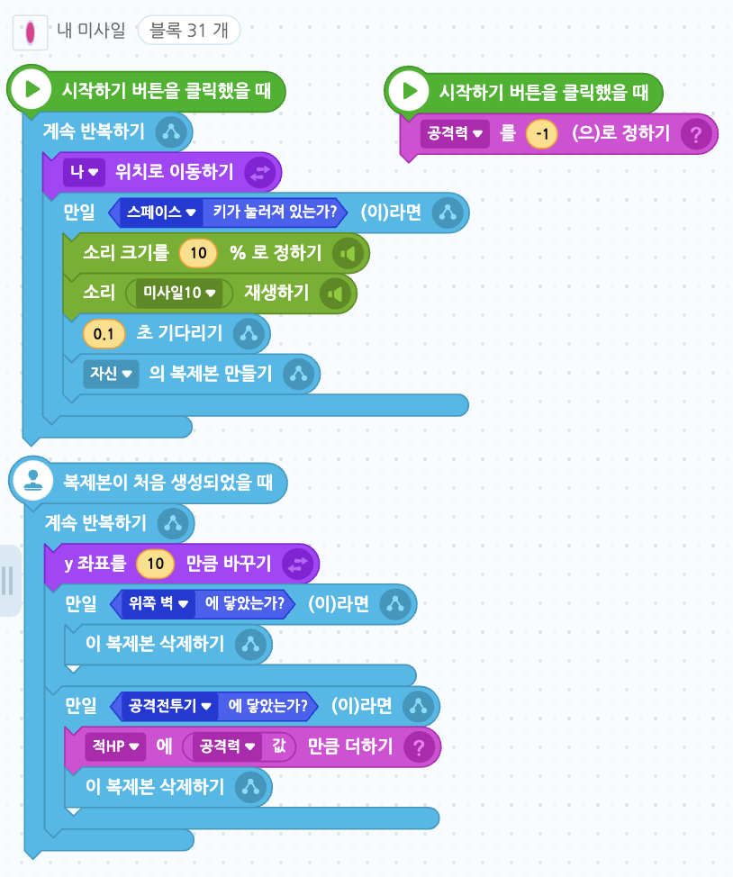  

<b>🧩 step6. </b> 아이템 코딩하기  
- 아이템 변수를 추가하고 0으로 초기화합니다.
- 15초동안 숨겨준 후 무작위 위치에서 보이게 합니다.
- 내 전투기가 아이템을 먹으면 아이템 변수가 +1되게 하고 다시 모양을 숨깁니다.
- 아이템은 15초 때 처음 나타난 후, 내 전투기가 아이템을 먹으면 다시 15초 뒤에 나타나는 알고리즘이 만들어집니다.
- 아이템이 반짝이는 효과를 주기 위해 계속 다음 모양으로 바꾸는 코드도 작성해줍니다.  
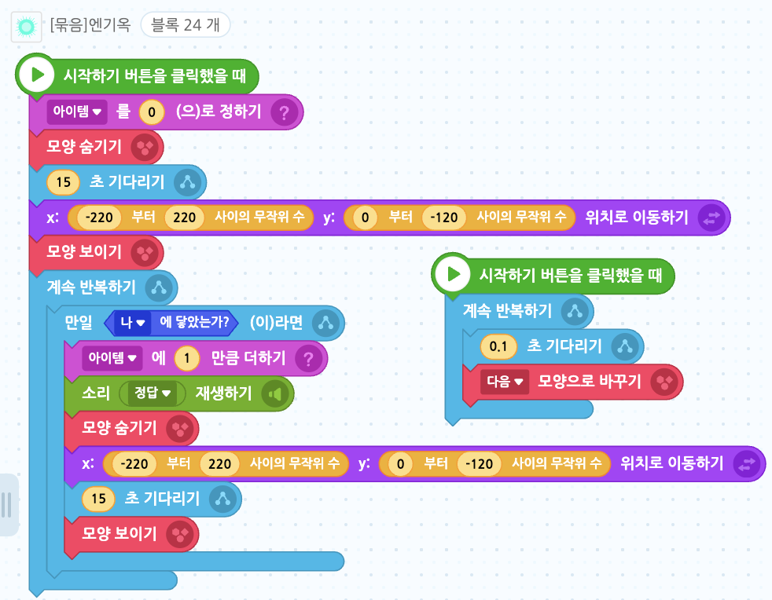  

<b>🧩 step7. </b> 레벨 추가하기  
- 레벨2, 레벨3 신호를 만들어줍니다.
- 아이템 값이 1이 되면 레벨2 신호를, 아이템 값이 2가 되면 레벨3 신호를 보내줍니다. 
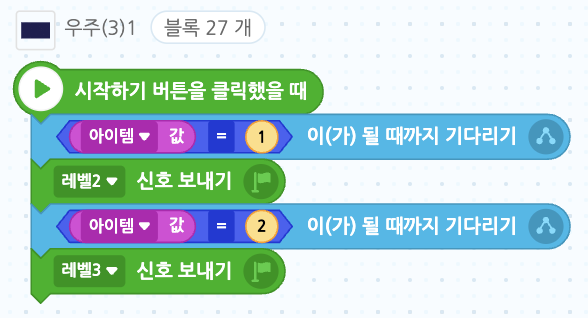  
- 레벨에 따라 공격력과 미사일 모양을 바꿔줍니다.
- 내 미사일 모양에 2가지 모양을 더 추가합니다.
- 레벨2 신호를 받으면 미사일 모양을 모양2로 바꿔줍니다.
- 레벨2 신호를 받으면 공격력 변수도 -2로 바꿔줍니다. 그러면 내 미사일이 적 전투기에 닿았을 때 적HP가 -1이 아닌 -2만큼 줄어듭니다.
- 레벨3 신호를 받으면 미사일 모양을 모양3로 바꿔줍니다.
- 레벨3 신호를 받으면 공격력 변수는 -3으로 바꿔줍니다. 그러면 내 미사일이 적 전투기에 닿았을 때 적HP가 -2가 아닌 -3만큼 줄어듭니다. 
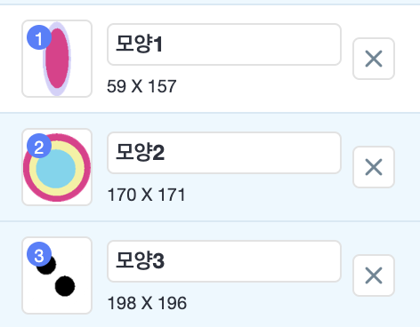 
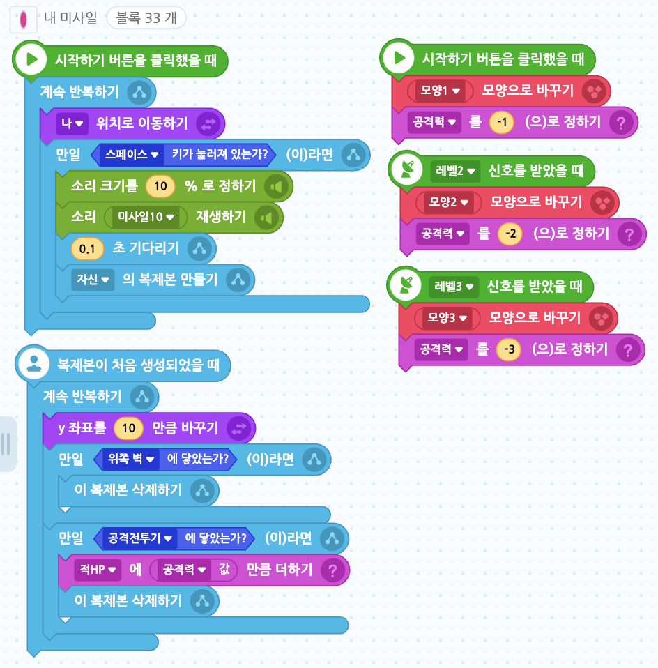  

<b>🧩 step8. </b> 적 미사일 레벨 추가하기  
- 이전에는 3개씩 0.3초 간격으로 5번 발사하는 거였다면, 이번에는 레벨에 따라 공격 속도 및 모양을 다르게 해줍니다.
- 처음, 즉 아이템 변수 값이 0일 때는 이전과 같습니다.
- 아이템 변수 값이 1이 되면 3개씩 0.2초 간격으로 6번 발사하게 해줍니다.
- 아이템 변수 값이 2가 되면 무작위 방향에서 3개씩 0.2초 간격으로 10번 발사되게 합니다. 
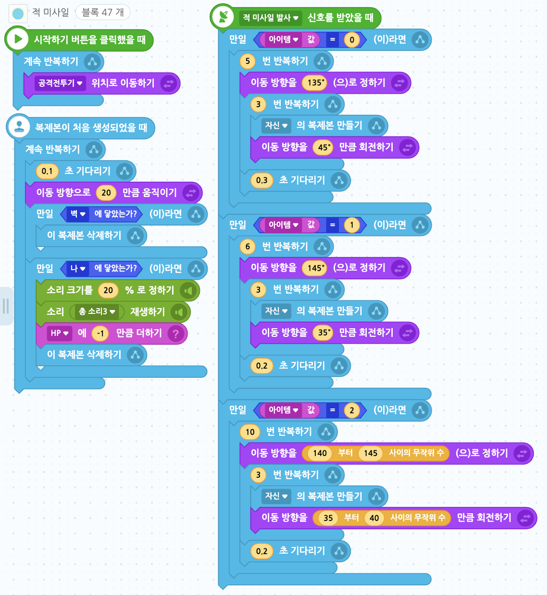  

<b>🧩 step9. </b> 레벨 표시 글상자 추가하기  
- 글상자를 추가합니다.
- 레벨 및 공격력에 대해 표시하기 위해 글상자를 꾸민 후 '전투기 슈팅게임 Start!', 'LEVEL 1공격력:1!!'을 2초씩 띄웁니다.
- 레벨 신호를 받으면 2초씩 레벨과 공격력을 2초간 말해줍니다.  
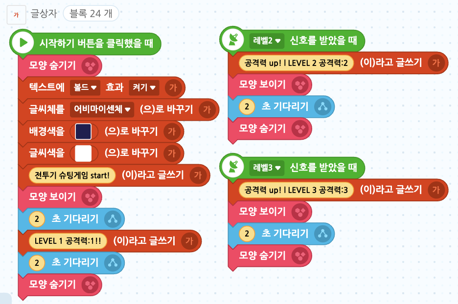  

<b>🧩 step10. </b> 결과 판정  
- 적 HP가 1보다 작아지면 win 신호, HP 신호가 0이 되면 lose 신호를 보내도록 신호를 각각 추가하고 보내줍니다. 
- 적 HP는 딱 0이 아니라 -3공격력을 받고 2에서 -1로, 또는 1에서 -2로 갈 수도 있기 때문에 1보다 작다는 조건을 사용해줍니다. 
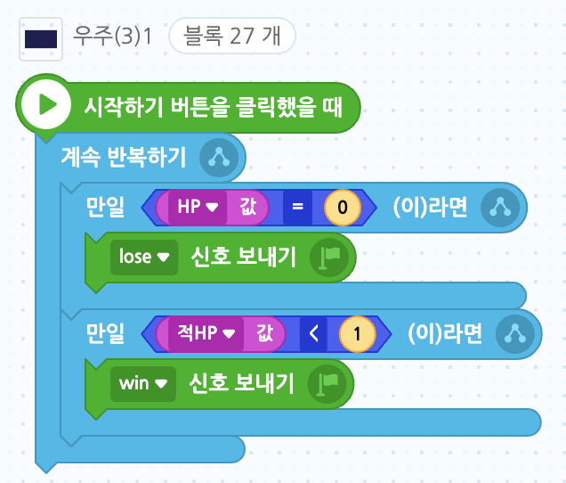  

<b>🧩 step11. </b> 결과 글상자  
- 결과를 표시하기 위한 글상자를 추가합니다.
- 처음에는 모양을 숨겨주고, lose/win 신호를 받으면 결과를 출력하고 모든 코드를 멈추게 합니다. 
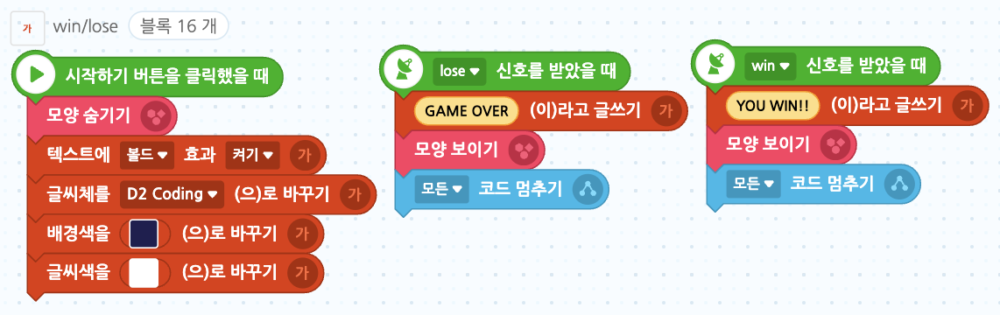  

<b>🧩 step12. </b> 배경 움직이기  
- 배경이 아래로 움직이는 것처럼 보이면 전투기가 위로 올라가는 것처럼 보이기 때문에 배경이 움직이게 해줍니다.
- 첫 배경의 위치를 (0,0)으로 정해주고 아래로 움직이게 해줍니다.
- 그리고 맨 밑, 즉 y좌표가 -270이 되면 맨 위, 즉 y좌표를 270으로 바꿔줍니다.
- 이렇게만 하면 빈칸이 생기기 때문에 배경을 복제하기 해줍니다.
- 두 번째 이 배경은 시작위치를 (0,270)로 바꿔주고 이전 배경과 같이 쭉 내려간 후 -270이 되면 다시 270으로 올라갈 수 있도록 해줍니다. 
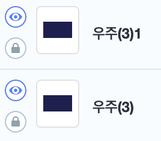 
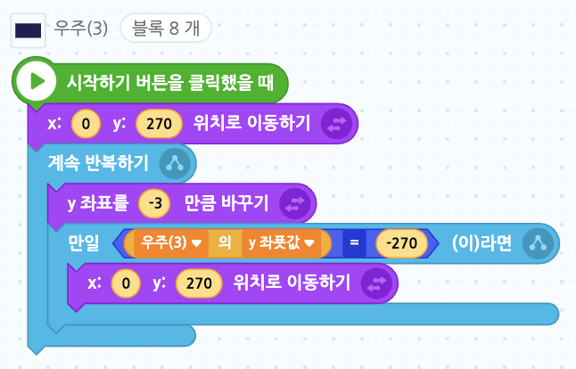 
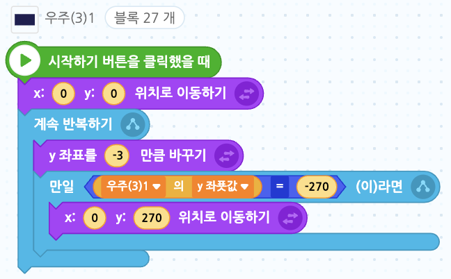 

